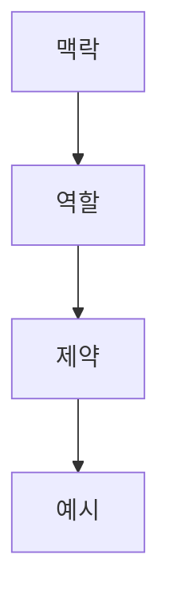

오늘은 새로운 걸 두 가지 배웠다. **Claude를 VSCode랑 같이 쓰는 법**, 그리고
**AI에게 물어볼 때 맥락/역할/제약/예시로 나눠서 써야 한다는 것**이다.
전에 배운 Git 내용도 같이 정리해서, 지금까지 배운 걸 한 번에 모아본다.

## 1. 지금까지 배운 것: Git

Git은 코드를 저장하고 되돌릴 수 있게 해주는 도구다.

| 명령어/개념 | 언제 쓰나 |
|---|---|
| `git init` | 폴더를 Git 저장소로 처음 만들 때 |
| 스테이징 (`git add`) | 커밋에 담을 파일을 미리 고를 때 |
| 커밋 (`git commit`) | 지금 상태를 하나의 기록으로 남길 때 |
| 브랜치 (`git branch`) | 원래 코드를 안 건드리고 따로 작업하고 싶을 때 |
| `git push` | 내 컴퓨터의 기록을 GitHub로 올릴 때 |
| `git pull` | GitHub의 최신 기록을 내 컴퓨터로 받아올 때 |
| `git merge` | 다른 브랜치에서 한 작업을 합칠 때 |
| 되돌리기 (`git reset`) | 잘못 스테이징하거나 커밋한 걸 취소하고 싶을 때 |

## 2. 오늘 배운 것: Claude를 VSCode에서 쓰기

지금까지는 Claude를 따로 켜서 썼는데, 오늘은 **VSCode 안에서 바로 Claude를 켜서 쓰는 법**을 배웠다.
VSCode 안에서 쓰면 내가 지금 보고 있는 파일, 폴더 상태를 Claude가 바로 볼 수 있어서
따로 코드를 복사해서 붙여넣지 않아도 된다.

| 방법 | 언제 쓰나 |
|---|---|
| VSCode 밖에서 Claude 사용 | 코드와 상관없는 일반적인 질문을 할 때 |
| VSCode 안에서 Claude 사용 | 지금 보고 있는 프로젝트/파일에 대해 바로 물어볼 때 |

## 3. 오늘 배운 것: AI에게 질문할 때 나눠서 쓰기

AI한테 그냥 두루뭉술하게 물어보면 원하는 답이 잘 안 나온다.
그래서 질문을 **맥락 → 역할 → 제약 → 예시**, 이렇게 네 부분으로 나눠서 쓰면 좋다는 걸 배웠다.

| 항목 | 무엇을 적나 | 언제 쓰나 |
|---|---|---|
| 맥락 | 지금 상황이 어떤지 | 왜 이 질문을 하는지 먼저 알려주고 싶을 때 |
| 역할 | AI가 어떤 입장에서 답해야 하는지 | 답변의 눈높이나 말투를 맞추고 싶을 때 |
| 제약 | 꼭 지켜야 할 조건 | 답이 엉뚱한 방향으로 안 새게 하고 싶을 때 |
| 예시 | 원하는 답의 형태 | 결과물이 어떤 모양이어야 하는지 보여주고 싶을 때 |

이렇게 네 부분으로 나눠서 물어보면, AI가 내가 원하는 걸 훨씬 더 잘 이해하고 답해준다.

## 오늘 정리하며 느낀 것

이번 주는 Git으로 코드를 저장하고 관리하는 법을 배웠고,
오늘은 그 위에 AI(Claude)를 도구로 잘 쓰는 법을 배웠다.
둘 다 결국 "내가 하는 작업을 기록해두고, 필요한 걸 명확하게 요청하는 것"이라는 공통점이 있는 것 같다.
