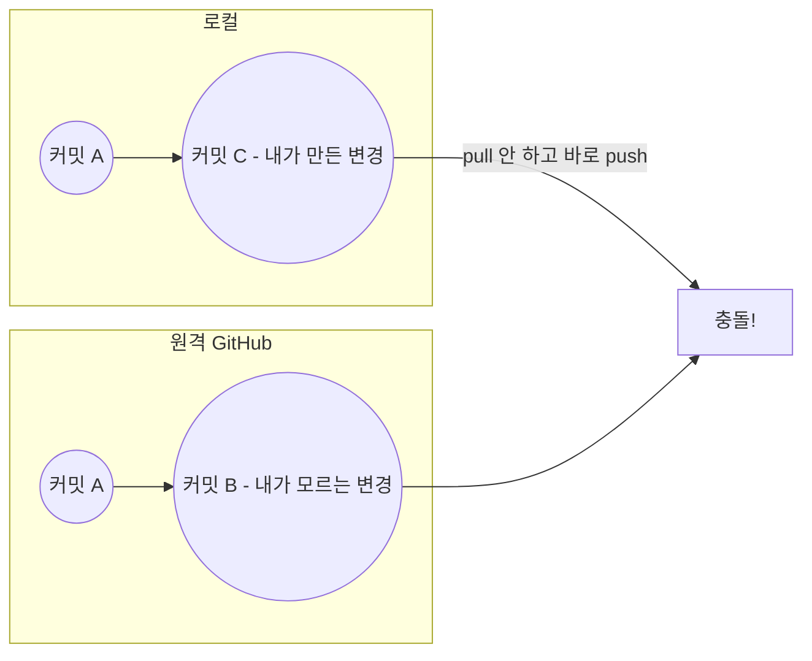
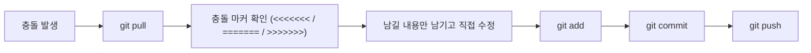

오늘 블로그 글을 올리려고 `git push`를 했는데 처음으로 **충돌(conflict)**을 겪었다.
왜 났는지, 어떻게 풀었는지, 다음부터는 뭘 다르게 할지 정리해본다.

## 1. 무슨 일이 있었나

로컬에서 글을 수정하고 바로 `git push`부터 했다.
그런데 그 사이에 원격 저장소(GitHub) 쪽에도 내가 모르는 변경사항이 먼저 올라가 있었고,
push가 거절되면서 결국 충돌이 났다.

## 2. 왜 충돌이 났을까

내 로컬 저장소와 원격 저장소가 이미 서로 다른 상태였는데,
`git pull`로 그 차이를 먼저 확인하지 않고 바로 `git push`를 해버린 게 원인이었다.



같은 커밋 A에서 로컬과 원격이 각자 다른 방향으로 진행돼 있었으니,
git 입장에서는 "둘 중 뭘 남겨야 할지 모르겠다"고 알려준 셈이다.

## 3. 어떻게 해결했나

당황하지 않고 순서대로 진행했다.

1. `git pull`로 원격의 최신 변경사항을 받아온다.
2. 충돌이 난 파일을 열면 아래처럼 표시가 생긴다. (실제 내용이 아니라 이해를 위한 예시 코드)

```
<<<<<<< HEAD
내가 로컬에서 쓴 내용
=======
원격에 이미 올라가 있던 내용
>>>>>>> abc1234 (원격 커밋)
```

3. `<<<<<<<`, `=======`, `>>>>>>>` 마커를 보면서 어느 쪽 내용을 남길지 직접 정하고, 필요 없는 부분과 마커 자체를 지운다.
4. `git add`로 수정한 파일을 다시 스테이징한다.
5. `git commit`으로 충돌을 해결했다는 커밋을 남긴다.
6. `git push`로 다시 올린다.



## 4. 앞으로는 이렇게 하기로 함

**push 하기 전에는 항상 pull 먼저 한다.**
로컬과 원격이 안 맞을 가능성을 미리 없애는 게, 나중에 충돌 마커를 읽으면서 수정하는 것보다 훨씬 편하다는 걸 몸으로 배웠다.

## 더 알아볼 것

- **충돌 마커(`<<<<<<<`, `=======`, `>>>>>>>`) 제대로 읽는 법** — 오늘은 뭐가 내 것이고 뭐가 원격 것인지 헷갈렸는데, 구조를 확실히 알아두면 다음엔 더 빨리 해결할 수 있을 것 같다.
- **merge와 rebase의 차이** — 오늘은 merge 방식으로 풀었는데, rebase로 풀면 히스토리가 어떻게 달라지는지 다음에 알아볼 것.

## 참고 자료

- [Git 공식 문서 - 충돌 해결하기](https://git-scm.com/book/ko/v2/Git%EB%B8%8C%EB%9E%9C%EC%B9%98%EC%99%80-Merge-%EC%B6%A9%EB%8F%8C-%EC%9D%98-%EA%B8%B0%EB%B3%B8)
