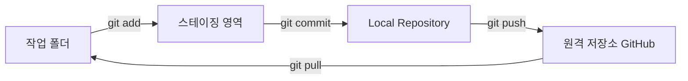
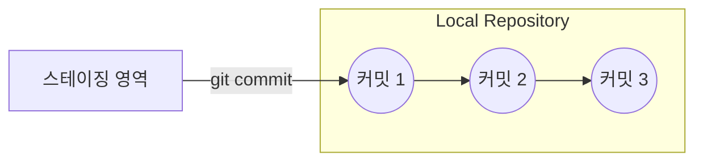
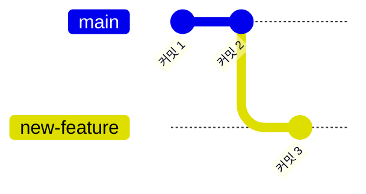
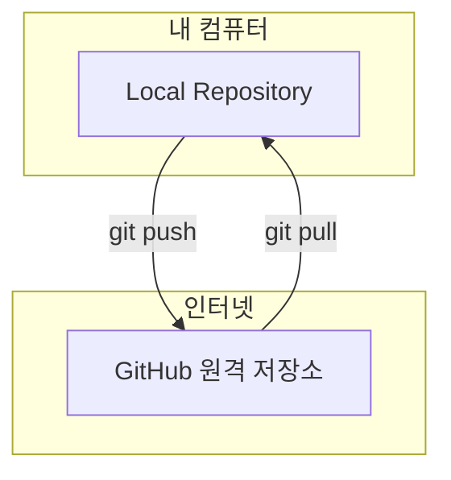
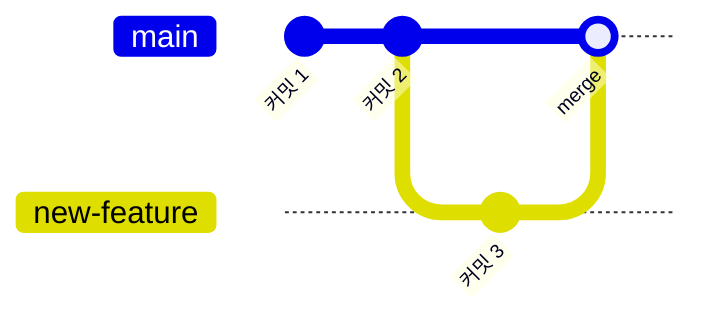

이번 주에는 **저장소 만들기 → 스테이징 → 커밋 → 브랜치 → push/pull → merge → 되돌리기**까지,
Git으로 코드를 관리하는 전체 흐름을 배웠다. 오늘은 이걸 한 번에 정리해본다.

## 1. 전체 흐름 한눈에 보기

Git 작업은 크게 네 개의 공간을 왔다 갔다 하는 일이다.

- **작업 폴더**: 내가 실제로 파일을 고치는 곳
- **스테이징 영역**: 다음 커밋에 담을 파일을 골라두는 곳
- **Local Repository**: 커밋(저장 기록)이 쌓이는, 내 컴퓨터 안의 저장소
- **원격 저장소(GitHub)**: 인터넷에 올라가 있는 저장소

| 명령어 | 언제 쓰나 |
|---|---|
| `git init` | 폴더를 Git 저장소로 처음 만들 때 |
| `git add` | 커밋에 담을 파일을 스테이징 영역에 올릴 때 |
| `git commit` | 스테이징된 내용을 Local Repository에 기록으로 남길 때 |
| `git branch` | 새로운 브랜치를 만들거나 목록을 볼 때 |
| `git push` | Local Repository의 기록을 GitHub로 올릴 때 |
| `git pull` | GitHub의 최신 기록을 내 컴퓨터로 받아올 때 |
| `git merge` | 다른 브랜치의 내용을 지금 브랜치로 합칠 때 |
| `git reset` | 스테이징하거나 커밋한 것을 되돌리고 싶을 때 |

## 2. 저장소 만들기

`git init`은 지금 폴더를 "Git이 관리하는 폴더"로 선언하는 명령이다.
이걸 해야만 add, commit 같은 다른 명령들이 의미를 가진다.

## 3. 스테이징

파일을 두 개 고쳐도 그중 하나만 커밋하고 싶을 때가 있다.
그래서 Git은 "커밋하기 전에 담을 것부터 고르는" 단계를 따로 둔다. 이게 스테이징이다.

## 4. Local Repository와 커밋

`git commit`을 하면 스테이징된 내용이 하나의 기록(스냅샷)으로 Local Repository에 저장된다.
Local Repository는 이런 기록들이 시간 순서대로 쌓여 있는, 내 컴퓨터 안의 저장소다.

| 개념 | 설명 |
|---|---|
| 스테이징 영역 | 커밋 직전에 담을 파일을 잠깐 모아두는 곳 |
| Local Repository | 커밋(기록)들이 실제로 저장되는 곳 |
| 커밋 | "지금 상태를 하나의 기록으로 남긴다"는 행동 |

## 5. 브랜치

브랜치는 "지금 상태에서 갈라져 나온 또 다른 작업 줄기"다.
기존 코드를 건드리지 않고 새 기능을 실험해보고 싶을 때 브랜치를 만든다.

## 6. push와 pull

`push`는 내 Local Repository의 기록을 GitHub로 올리는 것이고,
`pull`은 반대로 GitHub의 최신 기록을 내 컴퓨터로 받아오는 것이다.

## 7. merge

merge는 브랜치에서 따로 진행한 작업을 원래 브랜치로 합치는 것이다.
예를 들어 new-feature 브랜치에서 만든 커밋을 main 브랜치로 가져오고 싶을 때 쓴다.

## 8. 되돌리기

실수로 파일을 잘못 스테이징했거나, 아직 push하지 않은 커밋을 취소하고 싶을 때 `git reset`을 쓴다.
Local Repository 안에서만 벌어지는 일을 되돌리는 명령이라고 생각하면 된다.

## 오늘 정리하며 느낀 것

이번 주 흐름을 한 문장으로 요약하면:

> 파일을 고치고(작업 폴더) → 담을 것을 고르고(스테이징) → 기록으로 남기고(커밋, Local Repository) →
> 필요하면 갈라져서 작업하고(브랜치) → 합치고(merge) → 인터넷에 올리고 받아오고(push, pull) →
> 잘못됐으면 되돌린다(되돌리기).

이 순서만 기억하면 이번 주에 배운 명령어는 거의 다 설명이 된다.
