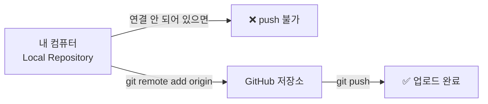
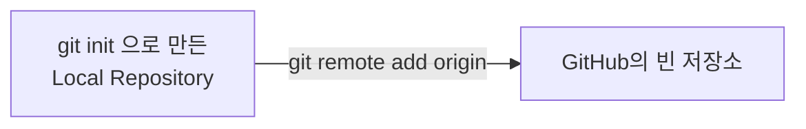
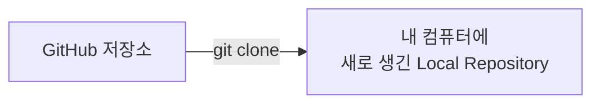

지금까지는 `git push`, `git pull`을 그냥 명령어로만 써봤는데,
오늘은 **내 컴퓨터의 Local Repository가 어떻게 GitHub 저장소랑 연결되는지**를 정리해본다.

## 1. 왜 "연결"이 필요할까

`git push`를 치면 Git은 "어디로 올려야 하는지" 알아야 한다.
그 "어디"를 미리 알려주는 작업이 바로 **원격 저장소 연결**이다.

## 2. 연결하는 두 가지 상황

시작하는 방향에 따라 방법이 다르다.

### 상황 1) 이미 내 컴퓨터에 저장소가 있는 경우

로컬에서 `git init`으로 저장소를 만들고 커밋도 해놨는데,
GitHub에는 아직 빈 저장소만 있는 경우다. 이때는 `git remote add`로 둘을 연결한다.

### 상황 2) GitHub에 있는 저장소를 처음 받아오는 경우

다른 사람이 만든 저장소, 혹은 예전에 GitHub에만 올려둔 저장소를 내 컴퓨터로 가져오고 싶을 때는
`git clone`을 쓴다. clone은 "복사해서 가져오면서 자동으로 연결까지 해준다"는 명령이다.

## 3. 명령어 정리

| 명령어 | 언제 쓰나 |
|---|---|
| `git remote add origin <주소>` | 로컬 저장소를 GitHub 저장소와 처음 연결할 때 |
| `git remote -v` | 지금 어떤 원격 저장소와 연결돼 있는지 확인하고 싶을 때 |
| `git clone <주소>` | GitHub에 있는 저장소를 내 컴퓨터로 그대로 가져오고 싶을 때 |
| `git push -u origin main` | 연결한 뒤 처음으로 push하면서, 앞으로는 `git push`만 쳐도 되게 만들고 싶을 때 |

## 4. origin이 뭘까

`origin`은 원격 저장소 주소한테 붙이는 **별명**이다.
매번 긴 GitHub 주소를 직접 치는 대신, `origin`이라는 짧은 이름으로 부르는 것이다.

| 실제로 하는 일 | 우리 눈에 보이는 것 |
|---|---|
| `https://github.com/아이디/저장소.git` 라는 주소 | `origin` 이라는 이름 |

## 5. -u는 왜 붙일까

처음 push할 때 `git push -u origin main`처럼 `-u`를 붙이면,
"내 로컬의 main 브랜치는 앞으로 origin의 main 브랜치랑 짝이다"라고 기억시켜주는 것이다.
그래서 다음번부터는 `git push`, `git pull`만 쳐도 Git이 어디로 가야 할지 스스로 안다.

## 오늘 정리하며 느낀 것

지금까지 push/pull은 그냥 "올리고 받아오는 명령"으로만 알고 있었는데,
사실 그 전에 **로컬 저장소와 GitHub 저장소를 연결하는 과정**이 먼저 있었다는 걸 알게 됐다.
연결만 한 번 잘 해두면, 그 다음부터는 지금까지 배운 push/pull/merge를 그대로 쓰면 된다.
