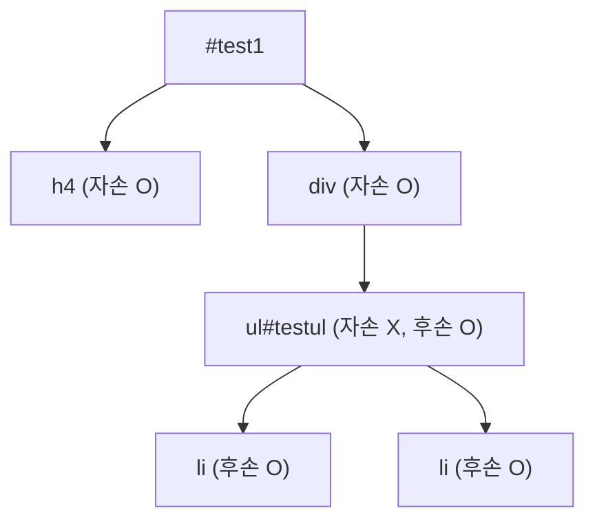
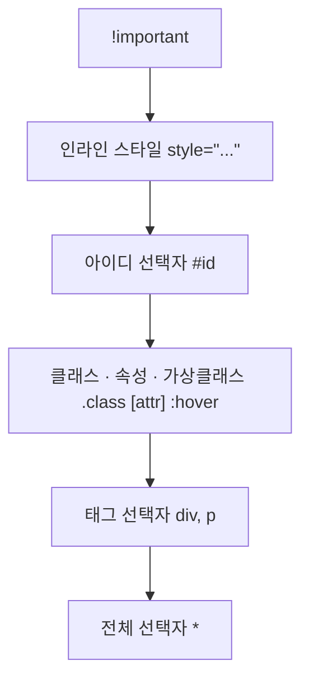

## 들어가며 (Situation)

지난 이틀(9/2~9/3) 부트캠프(원티드 X 을지대)에서 CSS 수업을 들었다. 선택자 3종 세트, 선택자 우선순위, Flexbox/Grid를 이용한 카드 배치, 그리고 마지막엔 같은 상품 카드 UI를 순수 CSS와 Tailwind로 각각 만들어보며 비교하는 실습까지 진행했다.

## 문제 상황 (Task)

[HTML 기초를 정리했을 때]()는 "태그가 다르면 의미가 다르다"가 화두였다면, CSS에서 제일 자주 부딪힌 문제는 **"분명 스타일을 줬는데 왜 안 먹히지?"** 였다. 구체적으로 이런 것들을 스스로 설명할 수 있어야 했다.

- 선택자 종류가 너무 많다(아이디/클래스/속성/후손/자손/형제/구조/부정/상태) — 뭘 언제 써야 하나?
- 같은 요소에 스타일이 여러 개 겹칠 때 뭐가 이기는지 몰라서 `!important`를 습관적으로 쓸 뻔했다.
- 카드 3개를 가로로 나란히 배치하는 게 왜 `div`만으로는 안 되는가?
- Tailwind는 기존 CSS랑 뭐가 다른 건가?

## 해결 과정 (Action)

### 1. 선택자, 종류별로 정리

**기본 선택자**

| 선택자 | 문법 | 의미 |
|---|---|---|
| 전체 선택자 | `*` | 문서 안의 모든 요소 |
| 태그 선택자 | `li` | 해당 태그 전부 |
| 아이디 선택자 | `#id3` | id가 일치하는 요소 (문서에 하나) |
| 클래스 선택자 | `.class3` | class가 일치하는 요소 (여러 개 가능) |

**속성 선택자** — `selector.css`에 정리된 걸 표로 다시 옮겨봤다.

| 문법 | 의미 |
|---|---|
| `[name=name2]` | 속성 값이 정확히 일치 |
| `[name~=name1]` | 속성 값이 띄어쓰기로 구분된 단어 중 하나로 포함 |
| <code>[class&#124;=class]</code> | 값이 일치하거나 `값-`로 시작 |
| `[name^=name]` | 값이 특정 문자열로 **시작** |
| `[class$=class]` | 값이 특정 문자열로 **끝남** |
| `[class*=div]` | 값에 특정 문자열을 **포함** |

**자손 선택자 vs 후손 선택자** — 이름이 비슷해서 제일 헷갈렸던 부분이다. 실습 파일 설명을 그대로 옮기면 "자손 선택자: 바로 아래에 있는 요소, 후손 선택자: 하위 요소 전부"였다.

```css
#test1 > h4 { background: hotpink; }   /* 자손: 바로 한 단계 아래 */
#test1 ul   { background: chocolate; } /* 후손: 몇 단계든 다 포함 */
```

이걸 트리로 그려보면 `#test1`의 **자손**은 바로 밑의 `h4`, `div`뿐이고, `ul` 안의 `li`까지는 **후손**에만 해당된다는 게 명확해진다.



**반응 선택자 / 상태 선택자**

| 선택자 | 의미 |
|---|---|
| `:hover` | 마우스가 올라왔을 때 |
| `:active` | 클릭하는 순간 |
| `:focus` | 입력창 등이 선택된 상태 |
| `:checked` | 체크박스/라디오가 선택된 상태 |
| `:enabled` / `:disabled` | 입력 가능/불가능 상태 |

**구조 선택자 / 부정 선택자**도 실습했다. `:nth-child(2n)`는 짝수 번째, `:nth-child(2n-1)`은 홀수 번째를 고르고, `:not(:nth-child(odd))`처럼 조건을 반대로 뒤집을 수도 있다는 걸 확인했다.

```css
#test :first-child { background: rebeccapurple; }
#test :nth-child(2n){ background: darkcyan; }     /* 짝수 번째 */
#test2 p:not(:nth-child(odd)) { background: orange; } /* 홀수가 아닌 것 = 짝수 */
```

### 2. 우선순위 — "왜 내 스타일이 안 먹혔는지"의 답

`04_선택자우선순위.html`에 있던 주석이 이번 수업의 결론이었다.

```
!important > 인라인 선택자 > 아이디 선택자 >
클래스 선택자 > 태그 선택자 > 전체 선택자
```



실습 코드로 직접 충돌시켜보니 확실히 이해됐다.

```html
<div id="test2" class="test2" style="background: greenyellow;">우선순위테스트</div>
```

```css
#test2 { background: mediumaquamarine; }        /* 아이디 선택자 */
.test2 { background: darkorange !important; }   /* !important 붙은 클래스 */
```

인라인 스타일(`greenyellow`)이 아이디 선택자보다 세지만, `.test2`에 `!important`가 붙는 순간 인라인 스타일마저 이긴다. **"더 나중에 쓴 게 이긴다"가 아니라 "더 구체적인(우선순위가 높은) 게 이긴다"**는 걸 직접 깨보고서야 체감했다.

### 3. 배치: Flexbox와 Grid

`05_flex_grid.html` 실습 파일 주석에 이유가 잘 정리되어 있었다. "`div`로만 영역을 설정하게 되면 화면의 가로축을 `div`가 전부 차지하게 된다. 또한 화면을 늘리거나 줄였을 때의 유연한 배치도 불가능하다."

| | Flexbox | Grid |
|---|---|---|
| 방향 | 1차원 (한 줄로 세움) | 2차원 (행 + 열) |
| 비유 | "한 줄로 세우고 정렬" | "칸을 그려두고 칸에 넣으며 정렬" |
| 이번 실습 | 카드 3장을 가로 한 줄로 | 카드 6장을 3열 그리드로 |

```css
.card-list {
  display: flex;
  flex-direction: row;       /* 주축: 기본값 row(가로) */
  justify-content: space-between; /* 주축 방향 정렬 */
  align-items: flex-start;   /* 교차축 방향 정렬 — 카드 높이를 늘리지 않으려고 */
  gap: 20px;
  flex-wrap: wrap;           /* 좁아지면 아래로 줄바꿈 */
}

.grid-list {
  display: grid;
  grid-template-columns: repeat(3, 1fr); /* 열 3개, 행은 자동(6개÷3열=2행) */
  gap: 20px;
}
```

주석 중에 제일 도움이 됐던 건 `align-items: flex-start`를 쓰는 이유였다. 기본값인 `stretch`를 쓰면 카드 높이가 컨테이너에 맞춰 다 똑같아지는데, 설명이 한 줄 더 있는 카드만 자연스럽게 길어지게 하려고 일부러 `flex-start`로 바꿨다는 것 — **속성값 하나가 "왜" 그 값인지까지 알아야 진짜 이해한 거라는 걸** 새삼 느꼈다.

**block / inline / inline-block**도 `display` 속성으로 서로 뒤바꿀 수 있다는 걸 확인했다.

```css
.box-block-span { display: block; }  /* span인데 div처럼 줄을 통째로 차지 */
.box-inline-div { display: inline; } /* div인데 span처럼 옆으로 붙음 */
```

즉 `div`/`span`이라는 **태그 이름 자체가 배치를 결정하는 게 아니라, 기본값으로 설정된 `display` 속성이 배치를 결정**하는 거였다. HTML 정리 글에서는 `div`=block, `span`=inline이라고 단순하게 정리했는데, 이번 실습으로 "그건 기본값일 뿐 언제든 바꿀 수 있다"는 걸 한 단계 더 배웠다.

### 4. hover와 transition으로 "살아있는" 느낌 주기

Tailwind 비교 실습 전 단계인 `style.css`에서 카드에 마우스를 올리면 떠오르는 효과와, NEW 배지가 깜빡이는 효과를 만들었다.

```css
.card {
  transition: all 0.3s; /* ⭐ transition은 :hover가 아니라 "원래 규칙"에 쓴다 */
}
.card:hover {
  transform: translate(0, -8px) scale(1.05);
  box-shadow: 0 8px 20px rgba(0, 0, 0, 0.12);
}

@keyframes blink {
  0%   { background-color: #DC2626; }
  50%  { background-color: #F97316; }
  100% { background-color: #DC2626; }
}
.badge {
  animation-name: blink;
  animation-duration: 1.2s;
  animation-iteration-count: infinite;
}
```

파일에 달려있던 주석 두 개가 특히 실전 팁이었다.

- `transition`을 `:hover`가 아니라 카드의 **원래 규칙**에 써야 마우스를 뗄 때도 부드럽게 원래대로 돌아온다.
- `.card:hover`처럼 **붙여 써야** "카드 자체에 마우스를 올렸을 때"이고, `.card :hover`처럼 띄어 쓰면 "카드 안의 어떤 요소에 마우스를 올렸을 때"라는 완전히 다른 뜻이 된다.

똑같아 보이는 코드 한 칸 차이(공백)가 결과를 완전히 바꾼다는 걸 확인한 부분이었다.

### 5. 같은 결과, 다른 방법 — Tailwind 맛보기

같은 상품 카드를 순수 CSS(`06_before_tailwind.html` + `style.css`)로 먼저 만들고, Tailwind 유틸리티 클래스로 다시 만들어보며 비교하는 실습이었다.

| | 순수 CSS | Tailwind |
|---|---|---|
| 스타일 위치 | 별도 `.css` 파일 | HTML class 속성 안에 직접 |
| 카드 하나 스타일 | `.card { background:#fff; border:1px solid #E5E7EB; ... }` | `class="bg-white border border-gray-200 rounded-lg p-4"` |
| hover 효과 | `.card:hover { transform: ...; }` | `class="hover:-translate-y-2 hover:scale-105"` |

Tailwind는 클래스 이름 자체가 곧 스타일이라, `.css` 파일을 오가지 않고 HTML만 보고도 어떤 스타일인지 바로 읽힌다는 장점을 느꼈다. 다만 솔직히 적어두면, `07_after_tailwind.html`은 아직 Tailwind 클래스 부분이 주석으로 처리된 채로 남아있다 — 이번 수업에서는 Bootstrap 버튼 하나만 확인했고, 카드 3개를 Tailwind로 완전히 바꾸는 건 다음 실습으로 남겨뒀다.

## 결과 (Result)

- 선택자 실습 3개 + 우선순위 1개 + Flexbox/Grid 1개 + Tailwind 비교용 파일 3개, 총 8개 파일을 직접 만들고 확인했다.
- 스타일이 "안 먹히는" 문제의 대부분은 코드가 틀려서가 아니라 **우선순위 계산을 못 해서**였다는 걸 확인했다. `!important`를 습관적으로 쓰기 전에 선택자 우선순위부터 점검하는 습관이 생겼다.
- Flexbox(`justify-content`/`align-items`)와 Grid(`grid-template-columns`)를 실제로 써보면서, "한 줄 정렬"과 "격자 배치"라는 각각의 역할 차이를 코드 없이도 설명할 수 있게 됐다.

## 더 학습하면 좋은 개념

- **CSS 커스텀 속성(변수)** — `#DC2626`, `20px` 같은 값이 여러 파일에 반복되는 걸 보면서, 값 하나를 변수로 빼두면 훨씬 유지보수가 편할 것 같다는 생각이 들었다.
- **미디어 쿼리(반응형 디자인)** — `flex-wrap: wrap`으로 줄바꿈은 되지만, 화면 크기별로 카드 개수 자체를 다르게 주려면 미디어 쿼리가 필요하다.
- **CSS Grid의 `grid-template-areas`** — 지금은 단순히 열 개수만 지정했는데, 레이아웃 영역에 이름을 붙여 배치하는 방식도 있다고 들었다.
- **Tailwind의 반응형/상태 variant 문법(`hover:`, `md:`, `dark:`)** — 오늘은 `hover:` 정도만 봤는데, 접두사 조합 규칙을 더 배워야 실전에서 쓸 수 있을 것 같다.
- **애니메이션 타이밍 함수(`ease`, `cubic-bezier`)** — `transition: all 0.3s`처럼 기본값만 썼는데, 움직임의 "느낌"을 세밀하게 조정하는 다음 단계가 있다고 한다.

## 참고 자료

- [MDN - Specificity](https://developer.mozilla.org/en-US/docs/Web/CSS/Specificity)
- [MDN - Basic concepts of flexbox](https://developer.mozilla.org/en-US/docs/Web/CSS/CSS_flexible_box_layout/Basic_concepts_of_flexbox)
- [Tailwind CSS - Styling with utility classes](https://tailwindcss.com/docs/styling-with-utility-classes)
