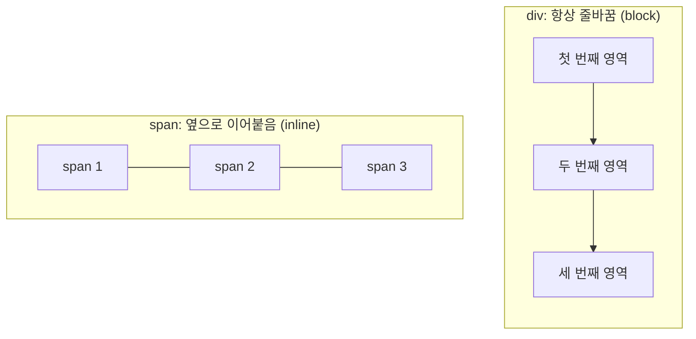
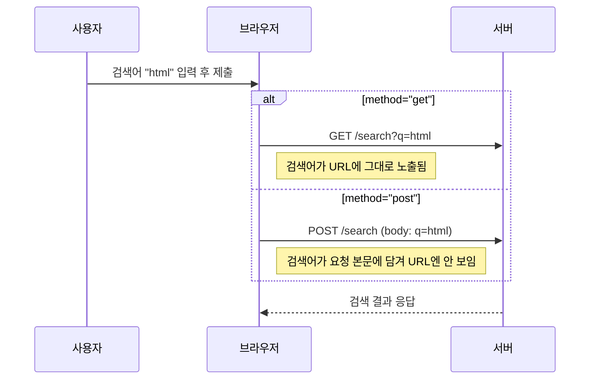

## 들어가며 (Situation)

이번 주 부트캠프(원티드 X 을지대)에서 HTML 기초 수업을 들었다. 글자, 목록, 표, 영역, 이미지, 미디어, 하이퍼링크, 폼까지 총 8개 파일로 나눠서 실습했고, 마지막엔 자기소개 페이지와 표 실습 문제를 직접 만들어봤다.

태그 자체는 하루 만에 다 "쳐볼" 수 있었다. 문제는 그다음이었다 — `<b>`랑 `<strong>`은 화면에 똑같이 굵게 나오는데 왜 둘 다 있는지, `<p>`랑 `<pre>`는 뭐가 다른지, `<div>`랑 `<span>`을 아무 데나 섞어 써도 되는 건지 하나도 설명을 못 하겠더라. 그래서 오늘 실습한 내용을 태그별로 다시 정리하면서, **겉보기엔 같아 보여도 실제로는 다른 태그들**을 중심으로 기록해두려고 한다.

## 문제 상황 (Task)

정리하면서 스스로 답할 수 있어야 했던 질문은 이거였다.

- `<p>`와 `<pre>`, 둘 다 "문단"인데 뭐가 다른가?
- `<b>`/`<i>`와 `<strong>`/`<em>`은 화면엔 똑같이 보이는데 왜 나눠져 있나?
- `<div>`와 `<span>`은 언제 골라 써야 하나?
- 표에서 `colspan`/`rowspan`은 왜 자꾸 칸이 어긋나게 만들었나?
- 폼의 `GET`과 `POST`는 실제로 뭐가 다른가?

단순히 "이런 태그가 있다"만 나열하면 다음에 또 까먹을 것 같아서, 각 태그를 실습 코드와 함께 **왜 구분해서 써야 하는지**까지 파고들어 정리했다.

## 해결 과정 (Action)

### 1. 문단 태그: `<p>` vs `<pre>`

실습 파일에 이렇게 주석이 달려 있었다.

```html
<p> 문단 영역을 나누는 태그는 p와 pre가 있다. p태그는 문단 영역을 나누는 태그
이지만, 한 칸의 공백만 입력 해주고, 줄바꿈은 적용하지 않게 된다.</p>
<pre> pre 태그는 여러 칸 띄어쓰기       혹은 줄 바꿈 등을 포함해서 화면에 표현한다. </pre>
```

직접 여러 칸 띄어쓰기와 줄바꿈을 넣고 비교해보니 확실히 느낌이 왔다. `<p>`는 내가 코드에서 아무리 띄어쓰기·줄바꿈을 넣어도 브라우저가 알아서 한 칸으로 뭉개버리고, `<pre>`는 내가 쓴 그대로(공백, 줄바꿈까지) 화면에 보여준다. 그래서 코드 블록이나 시(詩)처럼 원본 형태를 유지해야 하는 텍스트는 `<pre>`를 쓴다는 걸 알게 됐다.

### 2. "그냥 굵게" vs "중요해서 굵게" — `<b>`/`<i>` vs `<strong>`/`<em>`

실습 파일에는 `<b>`, `<strong>`, `<i>`, `<em>`이 나란히 있었는데, 브라우저에 렌더링해보면 정말 완전히 똑같아 보인다.

| 태그 | 화면 표시 | 의미 |
|------|-----------|------|
| `<strong>` | 굵게 | **중요한 내용**이라는 의미를 전달 |
| `<b>` | 굵게 | 의미 없이 스타일만 적용 |
| `<em>` | 기울임 | **강조**의 의미를 전달 |
| `<i>` | 기울임 | 의미 없이 스타일만 적용 |

MDN 문서를 찾아보니 겉모습이 같은 게 오히려 함정이었다. `<strong>`은 "strong importance"를 나타내는 시맨틱 태그라서 스크린 리더 같은 보조 기술이 실제로 "중요하다"고 인식하고 다르게 읽어주는데, `<b>`는 시각적으로만 굵을 뿐 그런 의미가 전달되지 않는다. 즉 **눈에 보이는 결과가 같다고 코드의 의미도 같은 게 아니라는** 걸 이번에 처음 체감했다.

### 3. 목록 태그: `<ul>`/`<ol>`과 `type` 속성

`<ul>`은 순서 없는 목록, `<ol>`은 순서 있는 목록이라는 건 직관적이었다. 재밌었던 건 `<ol>`의 `type` 속성으로 번호 스타일을 바꿀 수 있다는 점이었다.

| type 값 | 결과 |
|---------|------|
| (기본값) | 1, 2, 3 |
| `a` | a, b, c |
| `A` | A, B, C |
| `I` | I, II, III |

### 4. 표 태그: `colspan`/`rowspan`이 자꾸 어긋났던 이유

표 실습(회원 이력서, 공연요금표, 원티드 식단표)을 하면서 가장 많이 헤맸다. `<table>` - `<tr>`(행) - `<th>`/`<td>`(제목/데이터) 구조 자체는 어렵지 않았는데, 셀을 합치는 `colspan`(열 합치기)과 `rowspan`(행 합치기)을 같이 쓰니까 셀 개수 계산이 계속 꼬였다.

```html
<table border="2">
    <caption>회원 이력서</caption>
   <tr>
    <td colspan="2" rowspan="2" width="130px" height="150px">사진</td>
    <td width="80px">이름</td>
    <td width="200px"></td>
   </tr>
   <tr>
    <td>연락처</td>
    <td></td>
   </tr>
   ...
</table>
```

처음엔 `rowspan="2"`로 셀을 합쳤으면 다음 `<tr>`에서도 그 칸을 그대로 써야 하는 줄 알고 `<td>`를 하나 더 넣었다가 표가 밀렸다. **합쳐진 칸은 다음 행에서 아예 생략해야 한다**는 걸 표를 몇 번 깨뜨려보고서야 이해했다. 그다음부터는 종이에 격자를 먼저 그려서 어떤 칸이 합쳐질지 표시해두고 코드를 짜니까 훨씬 덜 꼬였다.

### 5. 영역 태그: `<div>`는 줄바꿈, `<span>`은 그대로

```html
<div style="border: 1px solid black; background: red;">첫 번째 영역 </div>
<div style="border: 1px solid black; background: blue;">두 번째 영역 </div>

<span style="border: 1px solid black; background: yellow;">첫 번째 span </span>
<span style="border: 1px solid black; background: orange;">두 번째 span </span>
```

실습 파일 주석 그대로, `<div>`는 블록 요소라 항상 다음 줄로 넘어가고, `<span>`은 인라인 요소라 옆으로 붙어서 나온다. 그림으로 그리면 이렇게 흐름이 다르다.



지금은 `div`/`span`만 배웠지만, 나중엔 의미 없는 `div`보다 `<header>`, `<section>`, `<article>` 같은 시맨틱 태그를 써야 한다는 얘기를 들어서 다음 학습 목표로 적어뒀다.

### 6. 이미지 태그: 고정 크기 vs 가변 크기

```html
<!-- 고정 크기: 화면이 변해도 그대로 -->

<!-- 가변 크기: 화면 크기에 비례해서 변함 -->

```

`width`를 px 대신 %로 주면 부모 요소 크기에 비례해서 이미지가 커지고 작아진다는 걸 확인했다. 나중에 반응형 레이아웃을 만들 때 계속 쓰일 개념이라 눈여겨봤다.

### 7. 미디어 태그: `<audio>`, `<video>`와 `controls`

```html
<audio src="sample/audio/major.mp3" controls loop></audio>
<video src="sample/video/video1.mp4" controls></video>
```

`controls` 속성 하나만 붙여도 재생/일시정지/볼륨 UI가 통째로 생긴다는 게 신기했다. 실습 문제에서는 `<video>` 안에 `<source>`를 넣어서 파일을 여러 개 지정하는 방식도 써봤는데, 브라우저가 지원하는 형식을 알아서 골라 재생해준다고 한다.

### 8. 하이퍼링크: `target` 속성과 `#id` 앵커로 목차 만들기

```html
<li><a href="02_목록관련태그.html" target="_blank">목록 관련 태그</a></li>
<li><a href="http://www.naver.com" target="_self">네이버</a></li>
```

`target="_blank"`는 새 탭으로, `target="_self"`는 현재 탭에서 이동한다는 차이를 확인했다. 제일 유용했던 건 `href="#id값"`으로 **한 페이지 안에서 특정 위치로 점프**하는 방법이었다. 목차를 클릭하면 해당 섹션으로 이동하고, 맨 아래 "메인으로" 링크를 누르면 다시 맨 위 제목(`id="title"`)으로 돌아가는 구조를 직접 만들어보니 앵커의 쓰임새가 확 와닿았다.

### 9. 폼 태그: `GET`과 `POST`는 진짜로 다르게 동작한다

폼 실습 파일에 있던 주석이 핵심이었다.

```
form 속성 주요 2가지
1. action 속성 - 폼의 입력 된 값들을 전송받을 서버의 주소
2. method 속성 - get / post 방식으로 서버 전송 방식 지정
   - get : url 에 넘어가는 데이터가 보인다
   - post : url 에 넘어가는 데이터가 감춰진다.
```

`<input>`도 `type` 하나로 텍스트, 비밀번호, 숫자, 날짜, 색상, 파일 업로드까지 다 처리한다는 게 인상 깊었다.

```html
<input type="text" name="userId" placeholder="아이디를 입력해주세요">
<input type="password" name="userPwd">
<input type="number" name="amount" min="0" max="10" step="3">
<input type="date" name="date">
<input type="radio" name="gender" value="남성">
<input type="checkbox" name="hobby" value="야구" checked>
```

`GET`과 `POST`가 데이터를 주고받는 방식이 다르다는 걸 시퀀스로 그려보니 왜 로그인 폼은 꼭 `POST`를 쓰는지 이해가 됐다.



## 결과 (Result)

- 태그 카테고리 8개(글자·목록·표·영역·이미지·미디어·하이퍼링크·폼) 실습 파일 + 자기소개 페이지 1개 + 표 실습 2개, 총 11개 파일을 직접 완성했다.
- 처음엔 표 실습에서 `colspan`/`rowspan` 계산이 계속 어긋났지만, 격자를 손으로 먼저 그려보는 방식으로 바꾼 뒤로는 실습문제.html의 시간표·식단표를 막히지 않고 완성했다.
- 무엇보다 "화면에 똑같이 보이는 태그도 의미가 다를 수 있다"(`b`/`strong`, `i`/`em`)는 걸 체감한 게 가장 큰 수확이다. 다음부터는 태그를 고를 때 "이게 스타일용인지, 의미 전달용인지"를 한 번 더 생각하게 될 것 같다.

## 더 학습하면 좋은 개념

- **시맨틱 HTML5 태그(`section`, `article`, `header`, `footer`)** — 지금은 `div`로 모든 영역을 나눴지만, 각 영역의 역할이 명확할 땐 시맨틱 태그를 쓰는 게 검색엔진과 스크린 리더 모두에 더 좋다고 한다. `div`와 헷갈리지 않으려면 다음 학습으로 꼭 짚고 넘어가야 할 개념.
- **웹 접근성(`alt`, `label for`, ARIA)** — 오늘 `img`의 `alt`와 `label`의 `for` 속성을 썼는데, 왜 꼭 챙겨야 하는지(스크린 리더 사용자를 위한 것)까지는 아직 깊이 이해 못 했다.
- **HTTP 요청/응답의 기본 구조** — 오늘은 GET/POST의 겉핥기만 했는데, 실제로 서버가 요청을 어떻게 받아서 처리하는지까지 알아야 폼을 제대로 쓸 수 있을 것 같다.
- **반응형 이미지(`srcset`, `picture`)** — 오늘은 `width`를 %로 주는 정도였지만, 화면 해상도에 따라 다른 이미지를 보내주는 방법도 있다고 들었다.
- **CSS 레이아웃(Flexbox, Grid)** — 오늘 만든 `div`/`span`/`table` 구조를 실제로 예쁘게 배치하려면 다음 단계로 CSS를 배워야 한다.

## 참고 자료

- [MDN - `<strong>`: The Strong Importance element](https://developer.mozilla.org/en-US/docs/Web/HTML/Reference/Elements/strong)
- [MDN - `<b>`: The Bring Attention To element](https://developer.mozilla.org/en-US/docs/Web/HTML/Element/b)
- [MDN - Sending form data (GET vs POST)](https://developer.mozilla.org/en-US/docs/Learn_web_development/Extensions/Forms/Sending_and_retrieving_form_data)
- [MDN - `<section>`: The Generic Section element](https://developer.mozilla.org/en-US/docs/Web/HTML/Reference/Elements/section)
