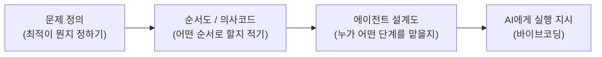
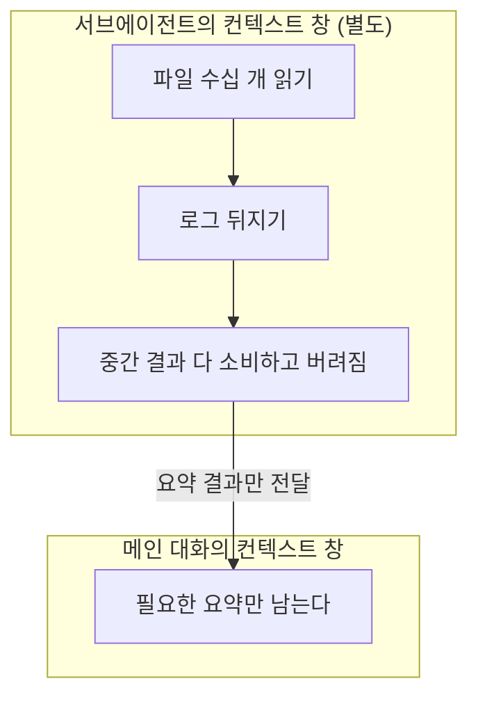

## 들어가며 (Situation)

오늘 부트캠프에서 "기획과 바이브코딩"이라는 주제로 수업을 들었다. 지금까지는 Claude 같은 AI에게 "이거 만들어줘"라고 바로 시키는 식으로 실습해왔는데, 오늘은 그 전에 필요한 단계 — 프로그래밍적 사고, 문제 정의, 순서도·의사코드, 에이전트 설계 — 를 배웠다. 그리고 직접 "최적이 뭔지"를 스스로 정의해서 아티팩트를 만들어보는 실습도 했다.

## 문제 상황 (Task)

그동안 AI를 쓸 때는 "일단 시켜보고 마음에 안 들면 다시 시킨다" 식으로 접근했다. 오늘 수업에서 이 방식의 한계를 짚어줬다.

- "잘 만들어줘"라고만 하면 AI도 뭐가 "잘"인지 모른다. **결과를 판단할 기준("최적"이 뭔지)을 내가 먼저 정하지 않으면**, AI도 나도 뭘 목표로 맞춰야 하는지 모른 채 답을 주고받게 된다.
- 복잡한 작업을 통째로 한 번에 시키면, 중간에 뭐가 잘못됐는지 짚어내기 어렵다.
- 에이전트를 여러 개 쓴다는 게 그냥 "여러 명이 있으면 빠르다"는 뜻이 아니라, **작업을 어떻게 쪼개는지**에 따라 결과 품질과 관리 편의성이 달라진다는 걸 몰랐다.

## 해결 과정 (Action)

### 1. 코드보다 먼저, 프로그래밍적 사고

바이브코딩은 "AI에게 말로 시켜서 코드를 만드는 것"이지만, 그 앞에 **프로그래밍적 사고**가 빠지면 안 된다는 게 오늘 수업의 첫 번째 요점이었다. 문제를 작은 단위로 쪼개고, 순서를 정하고, 예외 상황을 미리 따져보는 건 AI에게 맡기기 전에 사람이 먼저 해야 하는 일이라는 것. AI는 "무엇을 만들지"를 대신 고민해주는 도구가 아니라, 이미 정리된 생각을 실행해주는 도구에 가깝다는 걸 다시 확인했다.

### 2. 문제 정의: "최적"부터 정한다

가장 인상 깊었던 건 **"최적이 뭔지부터 정해야 한다"**는 원칙이었다. 실제로 직접 "최적"을 스스로 정의하고 그 기준에 맞춰 아티팩트를 만들어보는 실습을 했는데, 목표를 먼저 정하고 시작하니 프롬프트를 왔다갔다 고칠 일이 훨씬 줄었다.

| | 목표(최적) 없이 시작 | 목표(최적)를 먼저 정의 |
|---|---|---|
| 프롬프트 | "괜찮게 만들어줘" | "OO 조건을 만족하는 걸 최적으로 본다" |
| AI의 결과 판단 | AI 나름의 기준으로 판단 | 내가 정한 기준으로 비교 가능 |
| 수정 방식 | "이것도 아니고 저것도 아니고..." 반복 | 기준에 못 미친 부분만 콕 집어 수정 요청 |

"좋게 만들어줘"라는 말은 사람 사이에서도 기준이 없으면 안 통하는데, AI에게는 더더욱 그렇다는 걸 체감했다.

### 3. 순서도와 의사코드 — 코드가 되기 전에 생각을 확인하는 단계

목표를 정한 다음엔 그걸 바로 코드로 옮기지 않고, **순서도(flowchart)**나 **의사코드(pseudocode)**로 먼저 적어보는 단계를 배웠다. 실제 문법 없이 "무엇을 어떤 순서로 할지"만 적는 것이라, 코드를 몰라도 검토할 수 있고 AI에게 그대로 넘겨도 이해할 수 있는 형태가 된다.

말로만 "이렇게 저렇게 해줘"라고 하는 것과, 순서도로 단계를 미리 그려서 주는 것의 차이는 결국 **AI가 중간에 임의로 순서를 바꾸거나 단계를 생략할 여지를 줄여준다**는 데 있다는 걸 알게 됐다.

### 4. 에이전트 설계도 그리기

여러 에이전트를 쓸 때는 코드를 짜기 전에 먼저 **설계도**를 그린다 — 각 에이전트가 무엇을 입력받고, 무엇을 출력하고, 어떤 도구를 쓸 수 있는지를 미리 정하는 것이다. 예를 들어 "파일을 읽기만 하는 에이전트"와 "코드를 쓰는 에이전트"를 나눈다면, 전자는 읽기 도구만, 후자는 읽기·쓰기 도구를 갖는 식으로 **권한 자체를 역할에 맞게 제한**한다.

### 5. 단계를 나누면 에이전트도 나뉜다 — 그리고 "왜" 나누는가

작업을 여러 단계로 쪼갰다면, 그 단계 경계가 곧 에이전트를 나누는 기준이 된다는 걸 배웠다. 그런데 "그냥 나눠보자"가 아니라, **왜 나누는지**에 분명한 이유가 있었다.

- **역할이 섞이면 결과도 섞인다.** 조사하는 역할과 판단하는 역할이 한 에이전트에 섞이면, 조사 결과에 스스로 치우친 판단을 내리기 쉽다.
- **권한을 역할만큼만 준다.** 읽기만 해야 하는 단계에 쓰기 권한까지 주면, 의도치 않은 수정이 일어날 여지가 생긴다.
- **컨텍스트 창을 아낀다.** (아래 6번에서 이어서)

### 6. 컨텍스트 창으로 이해하기 — 왜 쪼개는 게 이득인가

**컨텍스트 창**은 AI가 한 번의 작업에서 한꺼번에 참고할 수 있는 정보(대화 내용, 읽은 파일, 중간 결과)의 총량이다. 파일을 수십 개 읽거나 로그를 잔뜩 뒤지는 조사 작업을 메인 대화에서 그대로 하면, 그 결과물이 전부 컨텍스트 창에 쌓여서 정작 중요한 판단을 내릴 때는 이미 창이 꽉 차버릴 수 있다.

**서브에이전트에게 조사·탐색을 맡기면, 그 과정에서 생긴 방대한 중간 결과물은 서브에이전트 자신의(별도) 컨텍스트 창 안에서 소비되고, 메인 대화에는 요약만 돌아온다.** "단계를 나누면 에이전트도 나뉜다"는 원칙의 실질적인 이유가 여기 있었다 — 단순히 일을 분담하는 게 아니라, **메인 대화의 컨텍스트 창을 오염시키지 않기 위해서**라는 것.

### 7. Skill과 Subagent, 뭐가 다른가

둘 다 "미리 정의해두고 필요할 때 쓰는 것"이라 헷갈렸는데, 둘의 차이는 **컨텍스트를 공유하는지 여부**에 있었다.

| | Skill | Subagent |
|---|---|---|
| 실행 위치 | 지금 대화의 컨텍스트 안에서 그대로 실행 | 별도의 컨텍스트 창에서 독립적으로 실행 |
| 돌려주는 것 | 작업 결과가 메인 대화에 그대로 남음 | 결과 "요약"만 메인 대화로 돌아옴 |
| 적합한 상황 | 반복되는 절차·규칙을 정해두고 그대로 따르게 할 때 | 조사처럼 부산물이 많이 남는 일을 메인 대화에서 떼어낼 때 |

즉 Skill은 "이 상황에서는 이렇게 해"라는 **정해진 절차를 불러오는 것**이고, Subagent는 "이 작업은 아예 딴 곳에서 처리하고 결과만 가져와"라는 **컨텍스트 분리**에 가깝다는 걸 정리하게 됐다.

### 8. (예고) 실무의 화면 설계 과정을 에이전트 두 명으로 옮기기

수업에서 다음 실습으로 "실무에서 화면을 설계하는 과정을 에이전트 두 명으로 나눠 옮겨보기"를 배웠다. 아직 직접 해보지는 않았지만, 5번에서 배운 "단계 경계 = 에이전트 경계" 원칙을 실제 업무 프로세스에 적용해보는 연습이라는 것만 먼저 적어둔다. 실습을 마치면 무엇을 두 역할로 나눴는지, 왜 그렇게 나눴는지 이어서 정리할 예정이다.

## 결과 (Result)

- "최적"을 직접 정의하고 시작한 프롬프트와, 기준 없이 시작한 프롬프트의 차이를 실습으로 체감했다 — 기준이 있으니 AI의 결과물을 "괜찮다/아니다"가 아니라 "어느 조건을 못 채웠다"로 구체적으로 판단할 수 있었다.
- Skill과 Subagent의 차이를 "컨텍스트를 공유하는지"라는 한 가지 기준으로 정리할 수 있게 됐다.
- 에이전트를 나누는 이유가 "일 분담"이 아니라 "컨텍스트 창 관리"라는 걸 알게 되면서, 앞으로 에이전트를 설계할 때 "이 단계가 메인 대화에 남겨도 되는 정보인가?"를 먼저 따져보게 될 것 같다.

## 더 학습하면 좋은 개념

- **화면 설계 → 2 에이전트 실습** — 예고만 받은 다음 실습. 실제로 해보고 무엇을 배웠는지 이어서 정리하기.
- **MCP(Model Context Protocol)** — 에이전트가 외부 도구·데이터에 연결되는 표준 방식이라고 들었는데 아직 개념만 안다.
- **프롬프트 엔지니어링 패턴** — "최적"을 정의하는 것도 결국 프롬프트를 어떻게 구조화하는지의 문제와 이어진다.
- **에이전트 간 조율(오케스트레이션)** — 에이전트가 3개, 4개로 늘어나면 순서·의존관계를 어떻게 관리하는지.
- **컨텍스트 엔지니어링** — 컨텍스트 창을 아끼는 것을 넘어, 무엇을 남기고 무엇을 버릴지 설계하는 더 넓은 개념이 있다고 들었다.

## 참고 자료

- [Claude Code - Extend Claude with skills](https://code.claude.com/docs/en/skills)
- [Claude Code - Create custom subagents](https://code.claude.com/docs/en/sub-agents)
