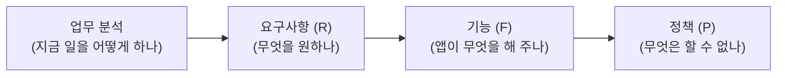
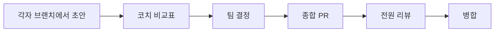

## 들어가며 (Situation)

지난 시간에는 팀 프로젝트의 문제를 한 문단(`01-problem.md`, "무엇이 왜 아픈가")으로 정의했다. 오늘은 그 문제를, 실제로 이 문서를 읽고 개발할 사람이 이해할 수 있도록 **네 장의 문서**로 펼치는 수업이었다 — 업무 분석 → 요구사항 → 기능 → 정책. 이번엔 이 네 장을 팀원 넷이 각자 쓰고, 에이전트를 "기획 파트너"로 써서 생각을 넓히고, git으로 각자의 의견을 모아 한 장의 문서로 합치는 방법까지 함께 배웠다.

## 문제 상황 (Task)

학습 목표를 읽으면서 스스로 답할 수 있어야 하는 질문들을 정리했다.

- 업무 분석 · 요구사항 · 기능 · 정책, 이 네 장은 각각 무슨 역할이고 서로 어떻게 가리켜야(참조해야) 하는가?
- "기획 파트너(에이전트)에게 발산 질문을 시킨다"는 게 정확히 뭘 의미하고, **왜 파트너가 대신 정하면 안 되는가**?
- 팀원 넷이 각자 쓴 문서를 어떻게 하나로 합치고, 합치는 과정에서 생기는 충돌은 어떻게 다뤄야 하는가?
- AI가 만든 문서에서, 그럴듯하지만 근거 없는 숫자를 어떻게 걸러내야 하는가?

## 해결 과정 (Action)

### 1. 문제 한 문단 → 문서 네 장으로 펼치기

지난 시간 문제 정의(`01-problem.md`)가 "무엇이 왜 아픈가"를 짚었다면, 이번 네 장은 그 문제를 해결하는 순서를 그대로 따라간다.

문제(왜 아픈가) → 업무 분석(지금 어떻게 일하는가) → 요구사항(그래서 뭘 원하는가) → 기능(앱이 뭘 해줄 것인가) → 정책(그중 뭘 못 해주는가)까지, **한 줄로 쭉 이어지는 인과관계**로 문서를 짜는 게 핵심이었다.

### 2. R·F·P, 세 글자로 압축한 관계

각 문서의 항목에는 **ID**를 붙이고, 다른 문서의 항목을 서로 가리키게(참조하게) 쓴다. 이렇게 하면 "이 기능은 왜 있는가"를 요구사항 문서로 되짚어볼 수 있고, "이 요구사항은 왜 이렇게밖에 못 해주는가"를 정책 문서로 확인할 수 있다.

| 문자 | 문서 | 한 줄 정의 |
|---|---|---|
| **R** | 요구사항 | 사용자가 **원하는 것** |
| **F** | 기능 | 앱이 실제로 **해 주는 것** |
| **P** | 정책 | F에 걸리는 제약, **"할 수 없다"까지** |

"R은 원하는 것, F는 해 주는 것, P는 F에 걸리는 할 수 없다까지" — 이 한 문장이 오늘 배운 내용을 제일 압축적으로 설명한다고 느꼈다. 요구사항이 곧 기능은 아니고, 기능에는 항상 한계(정책)가 따라붙는다는 걸 문서 구조 자체로 강제하는 셈이다.

### 3. 기획 파트너에게 "발산"은 시키되 "결정"은 안 맡긴다

에이전트를 "기획 파트너"로 써서, 팀이 미처 생각하지 못한 요구·예외·정책 후보를 `[제안]` 형식으로 받는다. 받은 제안은 하나하나 **채택하거나, 이유를 남기고 거절**한다.

- **왜 파트너가 대신 정하면 안 되는가**: 에이전트는 팀이 실제로 겪는 맥락(사용자, 제약, 우선순위)을 모른 채 그럴듯한 답을 내놓을 수 있다. 결정의 책임과 맥락은 늘 팀에 있어야 한다.
- **왜 제안은 받아야 하는가**: 팀 안에서는 익숙해서 안 보이는 사각지대(놓친 예외 상황, 빠뜨린 정책)를 바깥 시점에서 짚어줄 수 있다.

즉 에이전트의 역할은 "선택지를 넓혀주는 것"까지고, "선택하는 것"은 넘기지 않는다는 경계선을 분명히 긋는 게 오늘 배운 원칙이었다.

### 4. 넷이 따로 쓰고, git으로 하나로 모은다

문서마다 다음 흐름을 돌린다.

팀원 네 명이 같은 문서를 각자 브랜치에서 따로 초안을 쓰고, 코치가 네 초안을 비교표로 정리해주면, 그걸 보고 팀이 최종안을 결정한다. 그 결정을 종합 PR로 올려 전원이 리뷰하고 병합한다.

여기서 제일 새로웠던 건 **종합 PR에서 나는 충돌을 "코드 충돌"이 아니라 "의견 차이"로 읽으라는 것**이었다. git이 같은 줄을 다르게 고쳤다고 알려주는 그 지점이, 사실은 "팀원 두 명이 이 항목을 다르게 이해하고 있다"는 신호라는 것 — [GitHub 공식 문서](https://docs.github.com/en/pull-requests/collaborating-with-pull-requests/addressing-merge-conflicts/about-merge-conflicts)에서도 충돌은 "같은 줄을 다르게 고친 경쟁하는 변경사항"이라고 설명하는데, 이번 실습에서는 그 "경쟁하는 변경사항"을 코드가 아니라 **의견**으로 다뤄야 한다는 게 다른 점이었다.

### 5. 새 세션 "읽기 테스트"로 지어낸 수 잡아내기

문서를 다 쓴 다음엔, **그 문서를 쓴 적 없는 새 세션**에게 처음부터 다시 읽혀본다. 문서를 쓴 세션은 자기가 쓴 숫자를 "그럴듯하니까 맞다"고 넘어가기 쉬운데, 기억이 없는 새 세션은 "이 숫자는 어디서 나온 거지?"를 있는 그대로 물어볼 수 있다. 근거가 확인되지 않는 부분은 지우지 않고 **`[?]`로 표시해서 남겨둔다** — 나중에 실제 데이터로 채워 넣어야 할 자리라는 걸 문서에 그대로 기록해두기 위해서다.

## 결과 (Result)

- 업무 분석 → 요구사항(R) → 기능(F) → 정책(P)으로 이어지는 4장 문서 체계와, "R은 원하는 것 · F는 해주는 것 · P는 F의 한계"라는 관계를 내 말로 설명할 수 있게 됐다.
- "에이전트는 제안까지, 결정은 팀이"라는 경계선과 그 이유(맥락 부재 vs 사각지대 보완)를 정리했다.
- git 협업 흐름(브랜치 → 비교표 → 팀 결정 → 종합 PR → 전원 리뷰 → 병합)에서, 병합 충돌을 코드 문제가 아니라 **의견 차이**로 접근하는 관점을 배웠다.
- `[?]` 표시로 "모르는 걸 모른다고 남겨두는" 습관이 왜 필요한지(AI가 지어낸 숫자를 그대로 두지 않기 위해서) 이해했다.

## 더 학습하면 좋은 개념

- **요구사항 추적성(Requirements Traceability)** — 오늘 배운 "항목마다 ID로 서로 가리키기"가 실제 소프트웨어 공학에서는 어떤 형식으로 관리되는지 더 찾아보고 싶다.
- **git의 3-way merge 원리** — 충돌이 왜 발생하고 git이 내부적으로 어떻게 병합 지점을 계산하는지 더 깊이 알고 싶다.
- **AI 환각(hallucination) 탐지 기법** — 오늘의 "읽기 테스트"는 사람이 직접 새 세션으로 확인하는 방식이었는데, 이걸 자동화하는 방법도 있는지 궁금하다.
- **실제 요구사항 명세서(SRS) 표준 형식** — 오늘 만든 4장 구조가 업계 표준 양식과 어떻게 다르고 겹치는지 비교해보고 싶다.

## 참고 자료

- [GitHub Docs - About merge conflicts](https://docs.github.com/en/pull-requests/collaborating-with-pull-requests/addressing-merge-conflicts/about-merge-conflicts)
