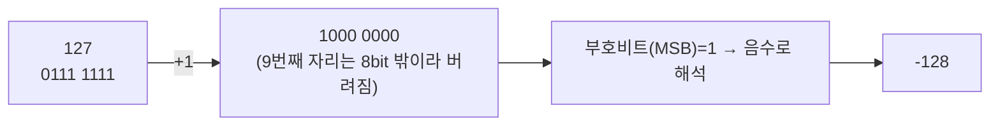
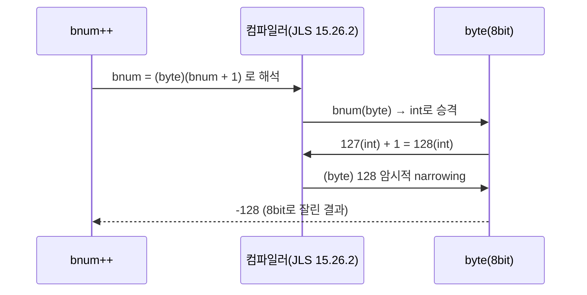

## 들어가며 (Situation)

Java 첫 수업. `Helloworld.java`로 시작해서 `Main.java`에서 Java 코드가 실행되는 과정을 훑고, 이어서 변수·자료형·형변환·연산자를 배웠다.

## 문제 상황 (Task)

수업 코드(`b_variable/module01/Application.java`)에는 이런 줄이 나란히 있었다.

```java
byte b = 10;    // 1 byte
short s = 10;   // 2 byte
int i = 10;     // 4 byte
long l = 10;    // 8 byte
```

**똑같이 `10`이라는 값을 담는데, 왜 자료형이 네 가지나 필요할까?** 오늘 수업은 이 질문에 답하기 위한 시간이었다. 정리하면 오늘 확인해야 했던 건 다음과 같다.

1. 리터럴(정수·실수·문자·문자열·논리)과 이를 담는 자료형 8종의 크기·범위
2. 변수의 선언과 초기화 규칙
3. 형변환(암시적/명시적)이 갈리는 기준
4. 산술·비교·논리·증감 연산자의 동작 방식

## 해결 과정 (Action)

### 1. Java 코드가 실행되는 과정부터

`a_basic/Main.java`에서 짚은 Java 실행 흐름은 다음과 같다.


`public static void main(String[] args)`가 모든 Java 프로그램의 시작점이 된다는 것도 함께 확인했다.

### 2. 자료형 8종, 크기로 정리하기

`b_variable/module01/Application.java`에서 다룬 리터럴과 자료형을 표로 정리했다. 리터럴은 정수·실수·문자·문자열·논리 다섯 종류로 나뉘고, 이를 담는 자료형은 **크기(바이트 수)가 각각 다르다** — 이게 바로 위에서 던진 질문의 답이다. 같은 `10`이라도 앞으로 얼마나 큰 값까지 다룰지에 따라 메모리를 얼마나 쓸지 미리 정해두는 것이 자료형의 역할이다.

| 자료형 | 분류 | 크기 | 비고 |
|---|---|---|---|
| `byte` | 정수 | 1 byte | 8-bit signed |
| `short` | 정수 | 2 byte | |
| `int` | 정수 | 4 byte | 기본 정수형 |
| `long` | 정수 | 8 byte | |
| `float` | 실수 | 4 byte | 리터럴 뒤에 `f` 필요 |
| `double` | 실수 | 8 byte | 기본 실수형 |
| `char` | 문자 | 2 byte | 유니코드 한 글자 |
| `boolean` | 논리 | - | `true` / `false` |

```java
byte b = 10;    // 1 byte
short s = 10;   // 2 byte
int i = 10;     // 4 byte
long l = 10;    // 8 byte
float f = 3.14f;  // 4 byte
double d = 3.14;  // 8 byte
char ch = 'ㅎ';
boolean bl = true;
```

같은 `{}` 영역 안에서는 같은 이름의 변수를 두 번 선언할 수 없다는 것, 그리고 변수는 `int num;`처럼 **선언**만 하거나 `num = 30;`으로 **초기화**를 나중에 해도 되고, `int num2 = 10;`처럼 **선언과 초기화를 동시에** 해도 된다는 것도 확인했다.

### 3. 형변환(Type Casting) — 암시적 vs 명시적

`b_variable/module02/Application.java`에서 다룬 형변환은 자료형이 나뉘어 있기 때문에 생기는 자연스러운 다음 문제다. 자료형의 크기가 다르니, 큰 자료형과 작은 자료형 사이를 오갈 때는 규칙이 필요하다.

| 구분 | 방향 | 데이터 손실 | 컴파일러 처리 |
|---|---|---|---|
| 암시적(묵시적) 형변환 | 작은 타입 → 큰 타입 | 없음 | 자동 변환 |
| 명시적 형변환 | 큰 타입 → 작은 타입 | 가능성 있음 | `(타입)` 캐스팅을 직접 써야 함 |

```java
double dnum = 99.99;      // 8 byte
int inum = (int) dnum;    // 4 byte, 명시적 형변환 → 소수점 손실

int num2 = 100;             // 4 byte
double dnum2 = (double) num2;  // 8 byte, 암시적 형변환도 가능
```

수업에서 강조한 부분은 "명시적 형변환은 데이터 손실 가능성이 있기 때문에, 손실을 감수한다는 걸 컴파일러에게 명시적으로 알려줘야 한다"는 것이었다. 큰 그릇(`double`)에서 작은 그릇(`int`)으로 옮길 때는 넘칠 수 있으니 스스로 `(int)`라고 써서 "이 손실은 감수하겠다"고 선언해야 하는 셈이다.

### 4. 연산자 정리

`c_operator/Application.java`로 산술·비교·논리·증감 연산자를 확인했다.

| 종류 | 연산자 | 비고 |
|---|---|---|
| 산술 연산 | `+ - * / %` | `%`는 나머지(모드 연산) |
| 비교 연산 | `== != < > <= >=` | 결과는 항상 `boolean` |
| 논리 연산 | `&& \|\| !` | 조건을 결합해 최종 참/거짓 판단 |
| 증감 연산 | `++ --` | 전위(`++age`) vs 후위(`age++`) |

```java
int a = 10;
int b = 3;
System.out.println(a + b);   // 13
System.out.println(a / b);   // 3 (정수 나눗셈)
System.out.println(a % b);   // 1 (나머지)

int age = 20;
System.out.println(++age);  // 21 — 먼저 증가시킨 값을 반환
System.out.println(age++);  // 21 — 먼저 반환하고 나중에 증가
System.out.println(age);    // 22
```

문자열과 `+`가 만나면 피연산자를 문자열로 바꿔서 이어붙인다는 것(`"안녕" + 3` → `"안녕3"`)과, 정수끼리 `/` 연산을 하면 소수점이 그대로 버려진다는 것도 오늘 눈여겨본 부분이다.

## 결과 (Result)

- "같은 `10`인데 왜 자료형이 다른가"라는 질문에 **"저장할 값의 범위와 메모리 크기가 다르기 때문"**이라고 내 말로 답할 수 있게 됐다.
- 오늘 배운 자료형 8종(byte/short/int/long/float/double/char/boolean), 형변환 2종(암시적/명시적), 연산자 4종(산술/비교/논리/증감)을 표와 코드로 정리했다.
- 수업 마지막에 이 개념들을 총동원해야 풀리는 실전 문제(`byte` 오버플로우)를 받았는데, 이 문제는 아래 "더 학습하면 좋은 개념"에서 따로 깊게 파봤다.

## 더 학습하면 좋은 개념

### byte bnum = 127; bnum++;가 128이 아닌 이유 — 비트와 형변환으로 뜯어보기

오늘 배운 자료형·형변환 개념을 총동원해서 풀어봐야 했던 문제가 있었다.

```java
byte bnum = 127;
bnum++;
System.out.println(bnum);
```

`127 + 1`이니까 당연히 `128`이 나올 거라 예상했는데, 실제로 실행하면 그렇지 않다. **byte는 8-bit 부호 있는 2의 보수(two's complement) 정수**이고, 표현 범위는 `-128 ~ 127`이다 ([Oracle 공식 문서](https://docs.oracle.com/javase/tutorial/java/nutsandbolts/datatypes.html)). 8비트로 표현할 수 있는 값은 정확히 2⁸ = 256가지뿐이고, 그중 최상위 비트(MSB)를 부호 비트로 쓰기 때문에 양수 쪽은 `0 ~ 127`(128가지), 음수 쪽은 `-1 ~ -128`(128가지)로 딱 나뉜다. `128`이라는 값은 애초에 이 256가지 안에 자리가 없다.

`bnum = 127`의 비트를 그대로 적어보면:

```
127 = 0111 1111
```

여기에 `+1`을 하면 8비트 안에서는 다음과 같이 계산된다.

```
  0111 1111   (127)
+ 0000 0001   (1)
-----------
  1000 0000   (9번째 자리 올림은 8비트 밖이라 버려짐)
```

`1000 0000`은 최상위 비트가 1이므로 **음수**로 해석되고, 2의 보수 규칙으로 읽으면 이 값은 `-128`이다. 즉 `127 + 1`이 "8비트라는 그릇"을 넘치면서(overflow) 값이 반대편 끝(`-128`)으로 튕겨 나가는 것이지, 128이 어딘가에 저장되는 게 아니다.



반대 방향인 **underflow**도 같은 원리다. `byte`의 최솟값 `-128`(`1000 0000`)에서 `1`을 빼면:

```
  1000 0000   (-128)
-        1
-----------
  0111 1111   (127)
```

최솟값 아래로 내려가려는 계산이 8비트 범위의 반대편 끝인 `127`로 넘어간다. 이렇게 최댓값을 넘어 최솟값으로 넘어가는 것이 **overflow**, 최솟값 아래로 내려가 최댓값으로 넘어가는 것이 **underflow**다 — 둘 다 "8비트라는 고정된 그릇 안에서 값이 순환(wrap-around)한다"는 같은 현상의 양쪽 방향일 뿐이다.

그런데 왜 컴파일 에러가 안 날까? 형변환 규칙대로라면 "명시적 형변환 없이 데이터 손실이 생기는 코드는 컴파일러가 에러를 낸다"고 배웠는데, `bnum++`은 캐스팅(`(byte)`)을 직접 쓴 적이 없는데도 에러 없이 실행된다.

이유는 `++`(그리고 `+=` 같은 복합 대입 연산자)가 **암시적으로 형변환을 포함하는 특별한 연산자**이기 때문이다. Java 언어 명세(JLS)는 복합 대입 연산자의 의미를 다음과 같이 정의한다 ([JLS §15.26.2 Compound Assignment Operators](https://docs.oracle.com/javase/specs/jls/se21/html/jls-15.html#jls-15.26.2)).

> `E1 op= E2`는 `E1 = (T)((E1) op (E2))`와 같다. 여기서 `T`는 `E1`의 타입이다.

즉 `bnum++`은 실제로는 다음 코드와 동일하게 동작한다.

```java
bnum = (byte) (bnum + 1);
```

계산 과정을 단계별로 보면:

1. `byte` 타입인 `bnum`은 산술 연산을 위해 먼저 **`int`로 승격(promotion)**된다. (Java의 산술 연산은 `int` 이상에서 수행된다.)
2. `int` 범위에서 `127 + 1 = 128`을 정상적으로 계산한다. (`int`는 32비트라 128을 문제없이 표현한다.)
3. 결과를 다시 `byte`에 대입하기 위해 **암시적으로 `(byte)` 캐스팅**이 적용된다.
4. `128`을 8비트로 좁히는(narrowing) 과정에서 위에서 본 것과 같은 비트 잘림이 일어나 `-128`이 된다.

만약 `++`가 아니라 `bnum = bnum + 1;`처럼 직접 썼다면, 이건 `int` 결과를 `byte` 변수에 캐스팅 없이 대입하는 코드가 되어 **컴파일 에러**가 난다. 반면 `bnum++`이나 `bnum += 1`은 언어 차원에서 "암시적 캐스팅이 이미 포함된 연산"이라 에러 없이 조용히 값을 잘라낸다는 게 핵심 차이였다.



실행 전 예상은 `128`이었지만 실제 결과는 `-128`이었다 — 이 간극을 **byte의 비트 폭(8bit) → overflow/underflow(값의 순환) → 암시적 narrowing 캐스팅**이라는 세 단계로 끊어서 설명할 수 있게 된 게 오늘의 가장 큰 수확이었다.

### 더 파보고 싶은 것들

- **2의 보수(Two's Complement) 표현** — 오늘은 byte 하나로만 확인했는데, `int`·`long`에서도 같은 방식으로 overflow가 일어난다. 왜 컴퓨터가 음수를 2의 보수로 표현하는지(뺄셈을 덧셈 회로로 처리할 수 있어서) 원리를 더 파보고 싶다.
- **산술 타입 승격(Numeric Promotion) 규칙** — `byte`/`short`/`char`가 연산 시 왜 항상 `int`로 승격되는지, JLS의 [Binary Numeric Promotion](https://docs.oracle.com/javase/specs/jls/se21/html/jls-5.html#jls-5.6.2) 규칙을 정확히 읽어보고 싶다.
- **`Byte.MAX_VALUE` / `Byte.MIN_VALUE`** — 매번 `-128`, `127`을 외우지 않고 코드에서 안전하게 범위를 참조하는 래퍼 클래스 상수 활용법.
- **다른 언어의 overflow 처리 방식** — Java는 오버플로우가 나도 조용히 값이 순환(wrap-around)하지만, Kotlin의 `Math.addExact`나 Swift의 오버플로우 연산자(`&+`)처럼 오버플로우를 명시적으로 다루게 강제하는 언어들과 비교해보고 싶다.
- **정수 오버플로우가 실제 장애로 이어진 사례** — 비트 잘림이 단순 이론이 아니라 실제 시스템 버그로 이어진 사례들을 찾아보면 이 개념이 왜 중요한지 체감할 수 있을 것 같다.
