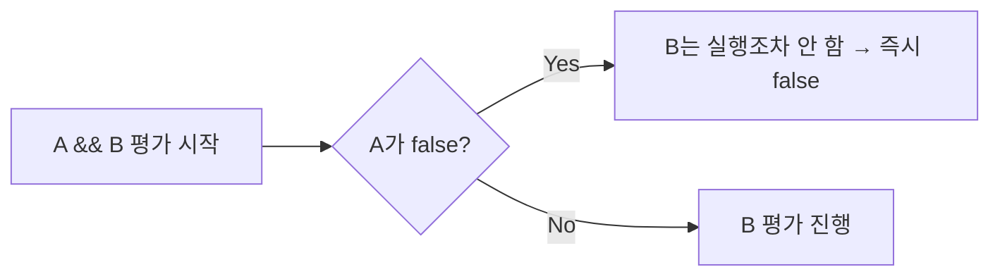
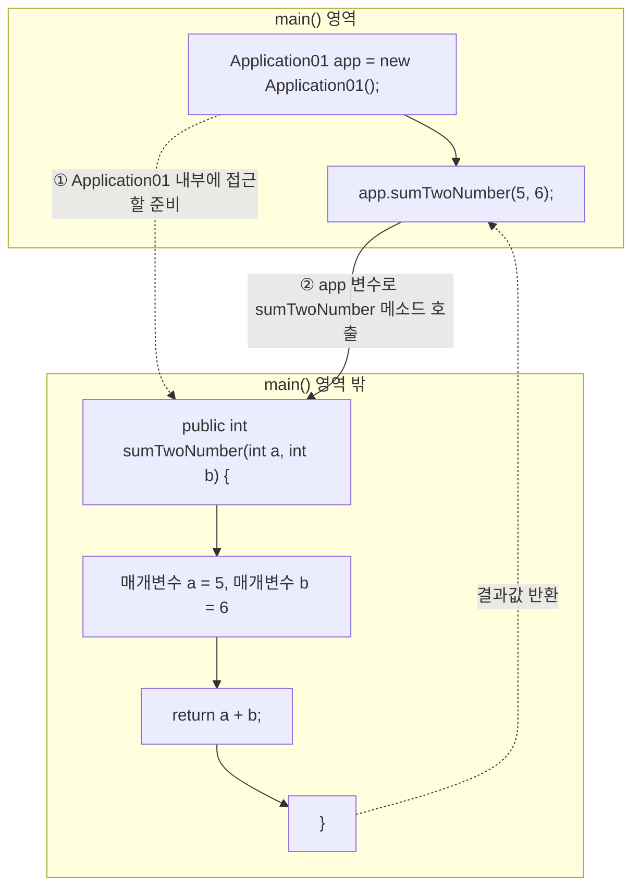
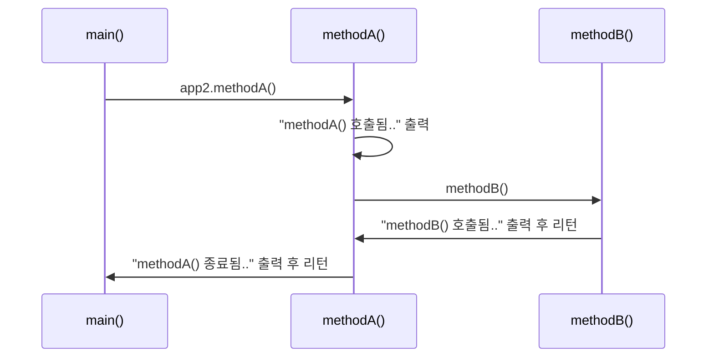

## 문제 상황 (Task)

`chap02-control-flow-and-method` 챕터로 진행한 수업. `a_controlflow`(if/switch), `b_loop`(for/while/do-while), `c_method`(메소드) 세 패키지를 순서대로 훑었는데, 강사님이 "오늘 중에 진짜 중요한 건 **메소드**"라고 강조하셔서 이 글도 메소드 비중을 가장 크게 잡았다. 오늘 확인해야 했던 것들.

1. `if-else`와 `switch`로 실행 흐름을 어떻게 "분기"시키는가
2. `&&`, `||`의 단축 평가(short-circuit evaluation)가 성능에 어떤 영향을 주는가
3. `for`, `while`, `do-while`의 차이는 무엇인가
4. **메소드가 없을 때 어떤 문제가 생기고, 메소드를 어떻게 정의하고 호출하는가**

## 해결 과정 (Action)

### 1. if-else — 조건에 따라 흐름을 분기

`a_controlflow/Application01.java`에서 점수(`score`)에 따라 등급을 출력하는 예제로 확인했다.

```java
int score = 80;

if (score >= 90) {
    System.out.println("A 등급입니다.");
} else if (score >= 80) {
    System.out.println("B 등급입니다.");
} else if (score >= 70) {
    System.out.println("C 등급입니다.");
} else {
    System.out.println("재수강 확정!");
}
```

형식은 `if(조건식) { 조건 만족 시 실행 } else { 조건 불만족 시 실행 }`이고, 조건식의 결과(`true`/`false`)에 따라 프로그램의 실행 흐름이 갈린다. `Application02.java`에서는 `Scanner`로 나이를 입력받아 청소년(13세 미만 50%)·노약자(65세 이상 30%) 할인율을 분기하는 실습도 함께 했다.

### 2. `&&` / `||` 단축 평가 — 조건 순서가 성능에 영향을 준다

`Application03.java`에서 다룬 내용인데, 단순 문법 설명보다 "왜 조건 순서가 중요한가"가 핵심이었다.

| 연산자 | 규칙 | 좌항에 두면 유리한 조건 |
|---|---|---|
| `&&` (AND) | 좌항이 `false`면 우항은 실행하지 않음 | **false 확률이 높은** 조건 |
| `\|\|` (OR) | 좌항이 `true`면 우항은 실행하지 않음 | **true 확률이 높은** 조건 |

회원가입 예시로 배운 논리: 아이디 중복 검사(1분 소요)와 비밀번호 8자 미만 검사(0.5초 소요)를 `&&`로 묶을 때, 실패 확률이 높고 검사 시간이 짧은 조건(비밀번호 길이)을 좌항에 두면 실패를 훨씬 빨리(0.5초 만에) 알 수 있다. 대규모 트래픽 상황에서는 이 순서 하나가 응답 속도와 메모리 사용에 실질적인 차이를 만든다.



### 3. switch문 — 다중 분기의 대안

`Application04.java`에서는 `if-else`가 길어질 때의 대안으로 `switch`를 확인했다.

```java
int month = 1;

switch (month) {
    case 1:
        System.out.println("1월~");
        break;
    case 2:
        System.out.println("2월~");
        break;
    default:
        System.out.println("그 외의 월입니다.");
}
```

`case`는 식과 값이 일치할 때 실행할 코드, `break`는 분기를 종료하고 `switch` 블록을 탈출하는 문법이다. **`break`를 빼먹으면 그 아래 `case`들의 코드까지 그대로 실행되어 버린다**는 점을 실습 중에 직접 확인했다. `default`는 `if-else`의 `else`에 해당한다.

### 4. 반복문 3종 — for / while / do-while

`b_loop` 패키지에서 세 반복문을 비교했다.

| 반복문 | 형식 | 특징 |
|---|---|---|
| `for` | `for(초기식; 조건식; 증감식) { ... }` | 반복 **횟수**가 정해져 있을 때 |
| `while` | `while(조건식) { ..., 증감식 }` | 반복 횟수가 불확실하거나 조건에 따라 종료할 때 |
| `do-while` | `do { ... } while(조건식);` | 조건과 무관하게 **최소 1회는 실행**한 뒤 조건 확인 |

`for`문 실습은 벤치프레스를 5번 반복하되 홀수번만 소리 내고 짝수번은 침묵하는 예제였다.

```java
for (int i = 1; i <= 5; i++) {
    if (i % 2 == 0) {
        System.out.println("침묵함..");
    } else {
        System.out.println("아림님" + i + "번 했습니다~");
    }
}
```

`do-while`은 `while`과 조건 검사 시점이 다르다는 게 핵심이다 — `while`은 먼저 조건을 보고 실행 여부를 정하지만, `do-while`은 무조건 한 번 실행한 뒤에야 조건을 확인한다.

### 5. 메소드 — 오늘의 핵심

`c_method/Application01.java`는 **메소드가 없을 때 어떤 문제가 생기는지**부터 보여주는 예제였다.

```java
int num1 = 1;
int num2 = 2;
System.out.println("1번째 연산 결과 : " + (num1 + num2));

int num3 = 3;
int num4 = 4;
System.out.println("2번째 연산 결과 : " + (num3 + num4));
```

두 수를 더하고 싶을 때마다 변수 선언 2줄 + 연산·출력 1줄이 계속 반복된다. **메소드**란 이런 반복을 없애기 위해 "특정 작업을 수행하는 코드블럭"을 한 번 정의해두고 필요할 때마다 불러 쓰는 것이다. 코드의 재사용성과 가독성을 높이고, 프로그램 구조를 체계적으로 만들며, 유지보수를 쉽게 해준다.

메소드 정의 형식은 다음과 같다.

```java
[접근제어자] [반환타입] 메소드명([매개변수 타입 매개변수명]) {
    실행할 코드
    [return 반환값;]
}
```

수업 중 그려주신 다이어그램을 그대로 옮기면, 메소드 호출은 이렇게 동작한다.



단계별로 뜯어보면:

1. **`클래스명 변수명 = new 클래스명();`** — `Application01 app = new Application01();`. 클래스는 `int`처럼 하나의 자료형이 될 수 있다. 이 줄은 `Application01` 내부(메소드들)에 접근하기 위한 준비 단계다.
2. **`변수명.메소드명(인자, ...);`** — `app.sumTwoNumber(5, 6);`. `.`(참조 연산자)로 `app`이 가리키는 `Application01` 내부의 `sumTwoNumber` 메소드에 접근한다. `()`는 프로그래밍에서 "메소드를 호출한다"는 의미다.
3. 호출 시 넘긴 `5`, `6`은 메소드 정의부의 **매개변수** `a`, `b`에 각각 `5`, `6`으로 대입된다.
4. 메소드 내부의 `return a + b;`가 실행되어 `11`이 계산되고, 이 값이 **호출한 자리(`app.sumTwoNumber(5, 6)`)로 그대로 돌아온다.** 그래서 `System.out.println("3번째 연산 :" + app.sumTwoNumber(5, 6));`은 `app.sumTwoNumber(5, 6)` 자리에 `11`이 대입된 것처럼 동작한다.

```java
System.out.println("3번째 연산 :" + app.sumTwoNumber(5, 6));   // 11
System.out.println("4번째 연산 :" + app.sumTwoNumber(7, 8));   // 15
System.out.println("5번째 연산 :" + app.sumTwoNumber(9, 10));  // 19

public int sumTwoNumber(int a, int b) {
    return a + b;
}
```

이제 두 수를 더하는 로직은 **딱 한 번만 작성**하면 되고, 호출부는 `app.sumTwoNumber(x, y)` 한 줄로 끝난다. 이게 메소드가 해결해주는 가장 직접적인 문제다.

### 6. 반환값 없는 메소드(`void`)와 메소드 간 호출

`Application02.java`는 메소드가 **서로를 호출**할 수 있다는 것과, 반환값이 없는 메소드(`void`)를 함께 보여준다.

```java
public static void main(String[] args) {
    System.out.println("main() 시작됨..");

    Application02 app2 = new Application02();
    app2.methodA();

    System.out.println("main() 종료됨...");
}

public void methodA() {
    System.out.println("methodA() 호출됨..");
    methodB();   // methodA() 내부에서 methodB() 호출
    System.out.println("methodA() 종료됨..");
}

public void methodB() {
    System.out.println("methodB() 호출됨..");
}
```

여기서 두 가지를 새로 확인했다.

- **`void`**는 "반환값이 없다"는 뜻이다. `sumTwoNumber`처럼 `return a + b;`로 값을 돌려주는 대신, `methodA()`/`methodB()`는 작업만 수행하고 끝난다.
- `methodB()`는 `main()`이 직접 부르지 않았다. `main()` → `methodA()` → `methodB()` 순서로, **메소드는 main() 안에서만이 아니라 다른 메소드 내부에서도 호출**될 수 있다.



## 결과 (Result)

- `if-else`/`switch`로 조건 분기를, `for`/`while`/`do-while`로 반복 제어를 코드로 직접 확인했다.
- `&&`/`||`의 단축 평가 원리를 알고 나니, 단순히 "조건을 나열"하는 게 아니라 **어떤 조건을 좌항에 둘지까지 설계할 수 있게** 됐다.
- 가장 큰 수확은 **메소드**다. `app.sumTwoNumber(5, 6)` 한 줄이 실제로는 (1) 클래스 접근 준비 → (2) `.`으로 메소드 접근 → (3) 인자가 매개변수로 대입 → (4) `return` 값이 호출 자리로 되돌아오는 4단계로 이루어진다는 걸 그림으로 그려가며 이해했다.
- 메소드 덕분에 "두 수를 더하는 코드"를 필요할 때마다 반복해서 쓰던 걸, 정의 한 번 + 호출 여러 번으로 줄일 수 있다는 걸 몸으로 확인했다.

## 더 학습하면 좋은 개념

- **매개변수(Parameter) vs 인자(Argument)** — 오늘은 `sumTwoNumber(int a, int b)`의 `a`, `b`(매개변수)와 호출 시 넘긴 `5`, `6`(인자)을 구분 없이 썼는데, 이 둘의 정확한 용어 차이와 값이 복사되어 전달되는 방식(call by value)을 더 정리해보고 싶다.
- **메소드 오버로딩(Overloading)** — `sumTwoNumber(int, int)` 외에 `sumTwoNumber(double, double)`처럼 같은 이름에 매개변수만 다른 메소드를 여러 개 정의할 수 있다는 것. 오늘 배운 "메소드 형식"의 자연스러운 다음 단계다.
- **static 메소드 vs 인스턴스 메소드** — 오늘 만든 `sumTwoNumber`, `methodA`는 모두 `new`로 객체를 만든 뒤 호출했는데, `main()`은 `static`이라 객체 생성 없이 바로 실행된다. 이 차이가 왜 생기는지 알아야 메소드 호출 구조를 완전히 이해할 수 있을 것 같다.
- **재귀 호출(Recursion)** — 오늘 `methodA()`가 `methodB()`를 호출하는 걸 봤는데, 메소드가 자기 자신을 호출하는 재귀도 같은 원리 위에 있다. 스택이 어떻게 쌓이고 풀리는지 궁금하다.
- **접근제어자(public/private 등)** — 메소드 형식에 `[접근제어자]`가 들어 있었는데 오늘은 전부 `public`만 썼다. `private`으로 선언하면 무엇이 달라지는지 다음 시간에 확인하고 싶다.

## 참고 자료

- [Oracle 공식 문서 - Classes and Objects (Defining Methods)](https://docs.oracle.com/javase/tutorial/java/javaOO/methods.html)
- [Oracle 공식 문서 - The if-then and if-then-else Statements](https://docs.oracle.com/javase/tutorial/java/nutsandbolts/if.html)
- [Oracle 공식 문서 - The switch Statement](https://docs.oracle.com/javase/tutorial/java/nutsandbolts/switch.html)
- [Oracle 공식 문서 - The while and do-while Statements](https://docs.oracle.com/javase/tutorial/java/nutsandbolts/while.html)
- [JLS §15.23/15.24 - Conditional-And/Or Operator (단축 평가)](https://docs.oracle.com/javase/specs/jls/se21/html/jls-15.html#jls-15.23)
