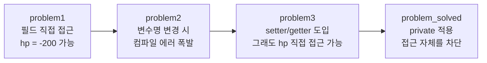
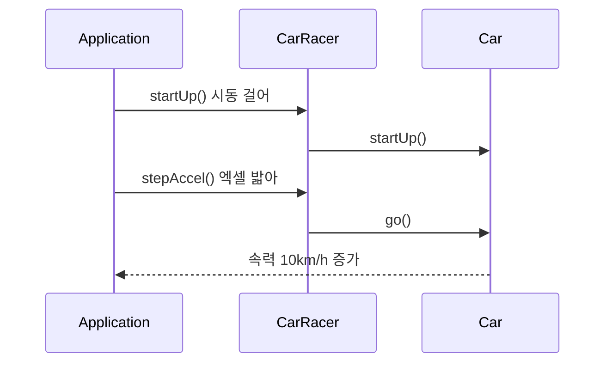
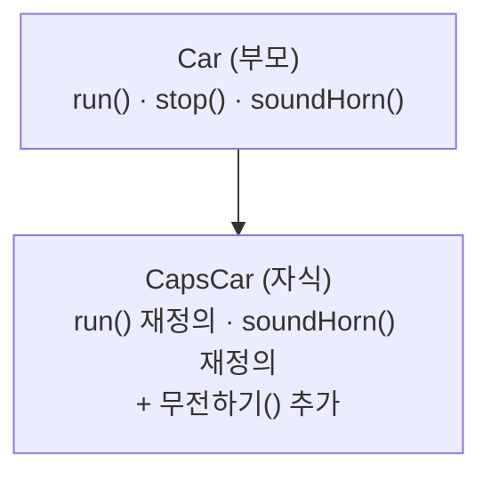

## 들어가며 (Situation)

`chap03-object-oriented-programming` 챕터에서는 **객체지향 프로그래밍(OOP)** 을 처음부터 끝까지 훑었다. 패키지 순서는 `a_object`(String·배열) → `b_oop`(클래스·생성자·캡슐화·추상화·오버로딩·static/final) → `c_inheritance`(상속) → `d_polymorphism`(다형성·인터페이스)이다.

양이 많아서 외우기 시작하면 금방 헷갈린다. 그래서 이 글은 **"기존 방식에 어떤 불편함이 있었고, 그걸 어떻게 해결하는가"** 의 흐름으로 정리했다. 모든 예제는 수업 시간에 직접 작성한 코드이다.

## 문제 상황 (Task)

OOP를 배우기 전에 쓰던 방식(기본 자료형 + 배열 + 메소드)의 한계는 이렇다.

1. 회원 1명의 정보(문자열, 숫자, 문자, 배열)를 **변수 하나로 묶을 수 없다.**
2. 필드에 아무 값이나 넣을 수 있어서 `hp = -200` 같은 **잘못된 값이 들어와도 막을 수 없다.**
3. 비슷한 코드를 클래스마다 **복사해서 붙여넣게 된다.**
4. 같은 역할인데 **종류만 다른 객체**(너구리, 코알라...)를 하나로 다루고 싶다.

오늘 배운 개념은 이 네 가지 불편함에 대한 답이다.

| 불편함 | 해결 개념 |
|---|---|
| 서로 다른 자료형을 묶고 싶다 | 클래스(사용자 정의 자료형) |
| 잘못된 값이 들어온다 | 캡슐화 (`private` + setter) |
| 현실을 코드로 단순하게 옮기고 싶다 | 추상화 |
| 코드가 중복된다 | 상속 (`extends`) |
| 여러 종류를 하나의 타입으로 다루고 싶다 | 다형성, 인터페이스 |

## 해결 과정 (Action)

### 1. 기초 다지기 - String과 배열 (`a_object`)

#### String은 `==`이 아니라 `equals()`로 비교한다

문자열을 만드는 방법은 두 가지이다.

```java
String str1 = "java";              // 리터럴 방식
String str2 = new String("java");  // 객체 생성 방식
String str3 = "java";
String str4 = new String("java");

System.out.println(str1 == str2);  // false
System.out.println(str1 == str3);  // true
System.out.println(str2 == str4);  // false
System.out.println(str1.equals(str2)); // true
```

`==`은 **같은 메모리 공간(주소)을 가리키는지** 비교하고, `equals()`는 **문자열 내용이 같은지** 비교한다.

- 리터럴(`"java"`)은 같은 문자열이면 이미 만들어 둔 것을 **재사용**하므로 `str1 == str3`이 `true`이다.
- `new`를 만나면 **항상 새 공간**을 만들기 때문에 내용이 같아도 `==`은 `false`이다.

> 쉬운 비유: `==`은 "같은 집에 사는가?", `equals()`는 "생김새가 똑같은가?"이다. 쌍둥이(`new`로 만든 두 개)는 생김새는 같지만 사는 집은 다르다.

그래서 문자열 비교는 **무조건 `equals()`** 를 쓴다. 수업에서 `length()`, `charAt(index)`, `trim()`도 확인했는데, 선생님 말씀대로 메소드를 통째로 외우기보다 **"써보고 → 출력해보고 → 이해하는"** 방식이 훨씬 오래 남았다.

#### 배열 - 같은 자료형의 묶음

변수는 값을 1개만 담는다. 5명의 점수를 합치려면 변수 5개가 필요한데, 배열을 쓰면 하나로 해결된다.

```java
int[] scores = new int[5];          // int 5칸짜리 배열
for (int i = 0; i < scores.length; i++) {
    scores[i] = sc.nextInt();       // 0번 칸부터 차례로 입력
}
```

신기했던 점은 **값을 넣지 않았는데도 `0`이 출력**된다는 것이다. 배열은 heap 메모리에 만들어지고, heap에는 "빈 칸"이 존재할 수 없어서 JVM이 기본값을 채워준다.

| 자료형 | 기본값 |
|---|---|
| 정수 | `0` |
| 실수 | `0.0` |
| 논리 | `false` |
| 참조형 | `null` |

### 2. 클래스 - 나만의 자료형 만들기 (`a_user_type`)

회원 정보는 `String id`, `String pwd`, `int age`, `char gender`, `String[] hobby`처럼 **자료형이 제각각**이라 배열로 묶을 수 없다. 변수를 따로따로 관리하면 메소드에 넘길 때 매개변수가 끝없이 늘어나고, 메소드는 값을 **하나만 return** 할 수 있어서 회원 정보를 통째로 돌려줄 수도 없다.

해결책이 **클래스**이다. 클래스는 `int`처럼 하나의 자료형이 될 수 있다.

```java
public class Member {
    String id;
    String pwd;
    String name;
    int age;
    char gender;
    String[] hobby;
}
```

```java
Member member = new Member();   // 클래스명 변수명 = new 클래스명();
member.id = "user02";           // .으로 필드에 접근
```

클래스 안에 바로 선언한 변수를 **필드(= 속성 = 인스턴스 변수)** 라고 한다.

> 쉬운 비유: **클래스는 붕어빵 틀**, **객체(인스턴스)는 틀로 찍어낸 붕어빵**이다. `new`는 "틀로 붕어빵 하나 찍어줘!"라는 뜻이다.

### 3. 생성자 - 객체가 태어날 때 가장 먼저 실행되는 메소드 (`b_constructor`)

`new Member()`에서 `Member()`는 사실 **생성자라는 메소드를 호출**하는 코드이다. 우리가 안 만들면 컴파일러가 빈 **기본 생성자**를 자동으로 넣어준다.

```java
public Member() {                       // 기본 생성자
    System.out.println("기본 생성자 동작함.");
}

public Member(String id, String pwd, String name,
              int age, char gender, String[] hobby) {   // 매개변수 있는 생성자
    this.id = id;
    this.pwd = pwd;
    // ... 생략
}
```

| 구분 | 형식 | 용도 |
|---|---|---|
| 일반 메소드 | `접근제한자 반환타입 메소드명(매개변수)` | 기능 수행 |
| 생성자 | `접근제한자 클래스명(매개변수)` (반환타입 없음) | 객체 생성 시점에 필드 초기화 |

**주의할 점**: 매개변수 있는 생성자를 하나라도 직접 만들면 컴파일러가 **기본 생성자를 더 이상 자동으로 만들어주지 않는다.** 그래서 `new Member()`도 쓰고 싶다면 기본 생성자를 직접 적어야 한다.

`this`는 "지금 만들어지는 **나 자신**"이라는 뜻이다. 매개변수 이름(`id`)과 필드 이름(`id`)이 같을 때 Java는 가까운 쪽(매개변수)을 먼저 보기 때문에, 필드에 값을 넣으려면 `this.id = id;`처럼 `this.`를 붙여야 한다.

### 4. 캡슐화 - 단계별로 문제를 직접 겪어보기 (`c_encapsulation`)

이 챕터가 제일 재미있었다. `Monster`(이름 + 체력) 클래스를 가지고 **문제 → 개선 → 또 문제 → 완성** 순서로 네 단계를 진행했기 때문이다.



**problem1 - 검증 없는 값이 들어간다**

```java
monster2.hp = -200;   // 체력이 음수? 컴파일러는 아무 말도 안 한다.
```

그래서 값을 검증하는 `setHP()` 메소드를 만들었다. 음수가 들어오면 `0`으로 바꿔준다.

```java
public void setHp(int hp) {
    if (hp >= 0) {
        this.hp = hp;
    } else {
        this.hp = 0;   // 잘못된 값은 0으로 강제
    }
}
```

**problem2 - 요구사항이 바뀌면 사방에서 에러가 난다**

기획이 바뀌어 `name` 필드를 `kinds`로 바꿨더니, `monster1.name`처럼 필드를 **직접 쓰던 모든 곳**에서 컴파일 에러가 동시에 터졌다. 필드를 밖에서 직접 만지고 있으면 클래스 내부를 바꿀 때마다 쓰는 쪽도 다 고쳐야 한다.

**problem3 - 메소드를 거치게 만들었더니 에러가 사라졌다. 하지만...**

`setName()`, `setHp()`, `getInfo()`로 접근하게 바꾸니 `Application`은 내부 변수명이 바뀌어도 영향을 받지 않았다. 그런데 아직 구멍이 있었다.

```java
monster3.hp = -5500;   // 메소드를 안 거치고 필드에 직접 접근하면 여전히 된다!
```

**problem_solved - `private`으로 문을 잠근다**

```java
public class Monster {
    private String kinds;
    private int hp;
    // setHp(), setName(), getInfo()는 public
}
```

`private`을 붙이면 외부에서는 필드 접근 자체가 컴파일 에러가 된다. 이제 값을 바꾸려면 **반드시 검증 로직이 들어있는 메소드를 거쳐야** 한다.

| 접근제한자 | 접근 가능 범위 (이번 수업에서 쓴 것 위주) |
|---|---|
| `private` | 같은 클래스 내부에서만 |
| `public` | 어디서든 |

> 쉬운 비유: ATM기를 떠올리면 된다. 은행 금고(`private` 필드)에 손님이 직접 손을 넣을 수는 없고, 입금·출금 창구(`public` 메소드)를 통해서만 돈을 넣고 뺄 수 있다. 창구에서는 "잔액 부족이면 출금 불가" 같은 규칙을 검사해준다.

이것이 **캡슐화**이다. 정리하면 **데이터를 숨기고(`private`), 공개된 메소드로만 접근하게 해서 값의 안전성을 지키는 것**이다.

### 5. 추상화 - 현실을 프로그램 목적에 맞게 단순화 (`d_abstraction`)

**추상화**는 공통된 핵심만 남기고 나머지는 덜어내는 것이다. 현실의 자동차는 부품이 수만 개지만, "카레이서가 운전하는 프로그램"에는 **시동 여부와 속력**만 필요하다.

수업에서는 요구사항 문장에서 **"~은/는, ~이/가" 앞에 나오는 단어가 클래스 후보**라는 요령을 배웠다. "카레이서가 자동차를..."에서 `CarRacer`와 `Car` 두 클래스가 나온다.



```java
public class CarRacer {
    private Car car = new Car();   // 클래스도 자료형이라 필드로 가질 수 있다

    public void startUp()   { car.startUp(); }
    public void stepAccel() { car.go(); }
    public void stepBreak() { car.stop(); }
    public void turnOff()   { car.turnOff(); }
}
```

설계 포인트 두 가지이다.

- `Car`의 상태(`speed`, `isOn`)는 `private`이다. 상태는 `Car`가 스스로 관리한다.
- `Application`은 `Car`를 직접 만지지 않고 **`CarRacer`에게 메시지만** 보낸다. 운전자가 엔진 내부를 만지지 않고 핸들과 페달만 쓰는 것과 같다.

`Car.turnOff()`를 보면 요구사항이 그대로 `if`문이 된다. "달리는 중에는 시동을 끌 수 없다"는 규칙이 `speed > 0`이면 거부하는 코드로 들어간다. **규칙을 객체 안에 넣어두니 `Application`은 규칙을 몰라도 된다.**

### 6. 오버로딩 - 이름은 같고 매개변수가 다른 메소드 (`e_overloading`)

메소드를 식별하는 고유값을 **메소드 시그니처**라고 하며, `메소드명(매개변수 타입들)`이다. 시그니처가 다르면 같은 이름의 메소드를 여러 개 만들 수 있다. 이것이 **오버로딩**이다.

| 바꾼 것 | 오버로딩 성립? | 이유 |
|---|---|---|
| 매개변수 **개수** | O | 시그니처가 달라짐 |
| 매개변수 **타입/순서** (`int, String` ↔ `String, int`) | O | 시그니처가 달라짐 |
| **접근제한자** | X (에러) | 시그니처에 포함되지 않음 |
| **반환타입** | X (에러) | 시그니처에 포함되지 않음 |
| 매개변수 **이름** (`num` → `num2`) | X (에러) | 시그니처에 포함되지 않음 |

처음엔 "반환타입이 다르면 되지 않나?" 싶었는데 직접 주석을 풀어서 에러를 확인하니 확실히 기억에 남았다.

### 7. static / singleton / final 키워드 (`f_keyword`)

#### static - 객체가 아니라 클래스에 소속

`static`이 붙은 변수/메소드는 **객체를 만들 때가 아니라 프로그램 시작 시점**에 메모리에 올라가며, 모든 객체가 **공유**한다.

```java
StaticFieldTest st1 = new StaticFieldTest();
st1.increaseNonStatic();   // st1의 nonStatiInt = 1
st1.increaseStatic();      // 공유 변수 staticInt = 1

StaticFieldTest st2 = new StaticFieldTest();
st2.getNonStatiInt();              // 0  (st2는 새 객체라 처음부터)
StaticFieldTest.getStaticInt();    // 1  (모두가 같은 값을 공유)
```

`st2`는 `increase`를 한 번도 호출하지 않았는데도 `static` 값은 `1`이다. 호출은 `객체.메소드()`가 아니라 **`클래스명.메소드()`** 로 하고, `this`는 쓰지 않는다.

> 쉬운 비유: `non-static`은 각자 가진 **개인 사물함**, `static`은 교실에 하나뿐인 **공용 칠판**이다. 누가 써도 모두에게 똑같이 보인다.

#### Singleton - 객체를 딱 하나만 만들기

TV 리모컨이 집에 여러 개일 필요는 없다. 객체를 하나만 만들어 공유하는 디자인 패턴이 **싱글톤**이다. 핵심은 **생성자를 `private`으로 막아서 밖에서 `new`를 못 하게 하고**, `static` 메소드로만 객체를 받게 하는 것이다.

| 구분 | Eager (이른 초기화) | Lazy (게으른 초기화) |
|---|---|---|
| 객체 생성 시점 | 클래스가 로딩될 때 미리 | `getInstance()`를 **처음 호출할 때** |
| 장점 | 단순하고 안전 | 안 쓰면 만들지 않아 자원 절약 |

```java
// Eager
private static EagerSingleton eager = new EagerSingleton();
public static EagerSingleton getInstance() { return eager; }

// Lazy
private static LazySingleton lazy;
public static LazySingleton getInstance() {
    if (lazy == null) {
        lazy = new LazySingleton();
    }
    return lazy;
}
```

`getInstance()`를 두 번 불러서 `hashCode()`를 찍어보면 **두 값이 같다.** 같은 객체라는 증거이다.

#### final - 한 번 정하면 바꿀 수 없다

`final` 필드는 **선언과 동시에** 초기화하거나, **생성자 안에서** 한 번만 초기화해야 한다. 그냥 선언만 하면 JVM이 기본값 `0`을 넣게 되는데, 이를 허용하지 않아서 컴파일 에러가 난다. 관례상 이름은 `NON_STATIC_NUM`처럼 **대문자와 `_`** 로 쓴다.

### 8. 상속 - 부모의 것을 물려받는다 (`c_inheritance`)

경찰차(`CapsCar`)도 자동차(`Car`)이므로 달리기, 경적 기능이 똑같이 필요하다. 이걸 복사해서 붙이는 대신 `extends`로 **부모의 필드와 메소드를 물려받는다.**

```java
public class CapsCar extends Car {

    @Override
    public void run() {                 // 부모 메소드를 재정의(Override)
        System.out.println("경찰차는 삐용삐용~~ 하면서 달립니다!");
    }

    public void 무전하기() {              // 자식만의 고유 기능
        System.out.println("치지지ㅣㅈㄱ...");
    }
}
```



- 반복되는 기능은 **부모에 한 번만** 작성한다.
- 다르게 동작해야 하는 메소드만 **`@Override`로 재정의**한다.
- 자식은 부모에 없는 **고유 기능도 추가**할 수 있다.
- 상속은 **IS-A 관계**("경찰차는 차다")가 성립할 때만 쓴다.

`new CapsCar()`를 실행하면 `Car`의 기본 생성자가 **먼저** 호출된 뒤 `CapsCar`의 생성자가 호출된다. 부모가 먼저 만들어져야 자식이 그 위에 올라갈 수 있기 때문이다. 부모 메소드를 그대로 쓰고 싶을 땐 `super.run()`처럼 `super`로 접근한다.

### 9. 다형성 - 하나의 타입으로 여러 객체 다루기 (`d_polymorphism`)

**다형성**은 하나의 인스턴스가 여러 타입을 가질 수 있다는 뜻이다. 너구리(`Raccoon`)는 너구리이면서 동물(`Animal`)이다.

```java
Animal a1 = new Raccoon();   // 부모 타입 변수에 자식 객체를 담는다 (O)
a1.bark();                   // "너굴너굴 너굴맨" ← Raccoon의 bark()가 실행된다!
```

변수 타입은 `Animal`인데 실행되는 건 `Raccoon`의 메소드이다. 이것이 **동적 바인딩**이다. 컴파일 때는 `Animal`의 메소드로 연결해 두었다가, **실행(런타임) 시점에 실제 객체가 가진 오버라이딩된 메소드로 바뀌어 동작**한다.

| 코드 | 가능? | 이유 |
|---|---|---|
| `Animal a = new Raccoon();` | O | 너구리는 동물이다 (IS-A) |
| `Raccoon r = new Animal();` | X | 동물이 모두 너구리는 아니다 |
| `a1.bite();` | X | 컴파일러는 `a1`을 `Animal`로 보므로, `Animal`에 없는 `bite()`는 모른다 |
| `((Raccoon) a1).bite();` | O | **강제 형변환**으로 `Raccoon`으로 보겠다고 알려줌 |

> 쉬운 비유: "동물 전원 집합!"이라고 외치면 너구리도 코알라도 달려온다. 그런데 "깨물기!"는 동물 공통 명령이 아니라서, 너구리라고 **확실히 아는 경우**에만(형변환) 시킬 수 있다.

#### 인터페이스 - "이 기능은 반드시 만들어라"

`interface`는 **Can-Do(할 수 있는 일)의 목록**이다. 구현부 없이 메소드 선언만 있고, 이를 받는 클래스가 **반드시 구현하도록 강제**한다.

```java
public interface Animal {
    void run();
    void eat();
    void bark();
}

public class Raccoon implements Animal {   // extends가 아니라 implements
    @Override public void run() { ... }
    @Override public void eat() { }
    @Override public void bark() { }
}
```

| 구분 | 클래스 상속 | 인터페이스 |
|---|---|---|
| 키워드 | `extends` | `implements` |
| 생성자 | 있음 | 없음 |
| 메소드 구현부 | 있을 수 있음 | 이번 수업 기준 없음(선언만) |
| `new`로 생성 | 가능 | **불가** (구현 클래스로 생성) |

`Animal animal = new Raccoon();`처럼 인터페이스 타입에 구현체를 담는 것도 **다형성**이다.

### 시행착오와 헷갈렸던 점

- **`==`과 `equals()`**: `new String("java")`끼리 `==` 비교했을 때 `false`가 나와서 한참 헷갈렸다. 비교 대상이 값이 아니라 **주소**였다.
- **기본 생성자 증발**: 매개변수 있는 생성자만 만들었는데 `new Member()`가 에러가 나서 당황했다. 직접 생성자를 하나라도 만들면 기본 생성자는 자동 생성되지 않는다.
- **`private`을 안 붙인 setter**: problem3에서 setter까지 만들었으니 끝난 줄 알았는데, 필드가 열려 있으면 우회가 가능했다. **검증 메소드만 만들어서는 안 되고, 필드를 닫아야 한다**는 걸 직접 코드로 겪어서 배웠다.
- **오버라이딩과 오버로딩 혼동**: 이름이 비슷하지만 전혀 다르다. 아래 표로 정리했다.

| 구분 | 오버로딩 (Overloading) | 오버라이딩 (Overriding) |
|---|---|---|
| 의미 | 같은 이름, **다른 매개변수**의 메소드를 여러 개 만든다 | 부모 메소드를 자식이 **다시 정의**한다 |
| 관계 | 한 클래스 안 | 부모-자식 사이 |
| 기억법 | **Over**load = 짐을 더 **싣는다**(메소드 추가) | **Over**ride = 덮어**탄다**(내용 교체) |

## 결과 (Result)

오늘 수업은 성능을 측정하는 내용이 아니라 설계 개념이라 수치 대신 **전후 비교**로 정리한다.

| 항목 | 배우기 전 | 배운 후 |
|---|---|---|
| 회원 정보 관리 | 변수 6개를 따로 관리 | `Member` 객체 1개 |
| 잘못된 값 방어 | `hp = -200`이 그대로 들어감 | `private` + `setHp()`가 `0`으로 보정 |
| 필드명 변경 영향 범위 | 사용하는 모든 곳에서 에러 | 클래스 내부만 수정 |
| 중복 코드 | 클래스마다 복사 | 부모 1곳에 작성, 자식은 `extends` |
| 여러 종류 처리 | 타입마다 따로 처리 | `Animal` 타입 하나로 처리 |

배운 점을 한 줄씩 정리하면 다음과 같다.

- **클래스** = 서로 다른 자료형을 묶는 나만의 자료형 (붕어빵 틀)
- **생성자** = 객체가 태어날 때 필드를 초기화하는 메소드
- **캡슐화** = `private`으로 닫고 메소드로만 접근, 값을 안전하게 지킴
- **추상화** = 프로그램 목적에 필요한 것만 남기고 단순화
- **상속** = 부모의 기능을 물려받고 필요한 것만 재정의
- **다형성** = 부모 타입 하나로 여러 자식 객체를 다룸

OOP는 결국 **"코드를 바꿀 때 고칠 곳을 최소로 만드는 방법"** 이라는 게 오늘 가장 크게 와닿은 점이다. 캡슐화의 problem2에서 에러가 사방에 터지는 걸 직접 본 덕분이다.

## 더 학습하면 좋은 개념

- **불변 객체(Immutable Object)와 `final`** — 오늘 `final` 필드는 값을 못 바꾼다고 배웠다. `String`이 불변 객체인 이유와 연결해서 이해하면 `==` vs `equals()` 차이와 문자열 풀(String Pool)이 더 선명해진다.
- **싱글톤의 스레드 안전성(Thread Safety)** — 오늘 만든 `LazySingleton`은 스레드 두 개가 동시에 `getInstance()`를 호출하면 객체가 둘 만들어질 수 있다. 실무에서 싱글톤을 안전하게 쓰려면 반드시 알아야 한다.
- **추상 클래스(abstract class) vs 인터페이스** — 둘 다 "구현을 강제"하는 도구인데 언제 무엇을 쓰는지 기준이 있다. 상속과 다형성 설계의 다음 단계이다.
- **상속보다 합성(Composition)** — `CarRacer`가 `Car`를 필드로 가진 구조가 합성이다. 상속은 부모와 자식이 강하게 묶이기 때문에 "상속보다 합성을 우선하라"는 설계 원칙이 왜 나왔는지 알아두면 좋다.
- **`equals()`와 `hashCode()` 오버라이딩** — 오늘 `toString()`을 재정의하고 `hashCode()`로 싱글톤을 확인했다. 직접 만든 클래스를 비교하거나 `HashMap`에 쓰려면 두 메소드를 올바르게 재정의해야 한다.

## 참고 자료

- [Oracle 공식 문서 - Classes and Objects](https://docs.oracle.com/javase/tutorial/java/javaOO/index.html)
- [Oracle 공식 문서 - Controlling Access to Members of a Class](https://docs.oracle.com/javase/tutorial/java/javaOO/accesscontrol.html)
- [Oracle 공식 문서 - Providing Constructors for Your Classes](https://docs.oracle.com/javase/tutorial/java/javaOO/constructors.html)
- [Oracle 공식 문서 - Understanding Class Members (static)](https://docs.oracle.com/javase/tutorial/java/javaOO/classvars.html)
- [Oracle 공식 문서 - Inheritance](https://docs.oracle.com/javase/tutorial/java/IandI/subclasses.html)
- [Oracle 공식 문서 - Polymorphism](https://docs.oracle.com/javase/tutorial/java/IandI/polymorphism.html)
- [Oracle 공식 문서 - Interfaces](https://docs.oracle.com/javase/tutorial/java/IandI/createinterface.html)
- [Oracle 공식 문서 - Defining Methods (Overloading)](https://docs.oracle.com/javase/tutorial/java/javaOO/methods.html)
